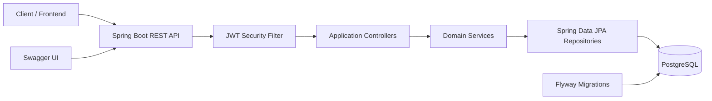

# Hamro Chalchitraghar Backend

Audit-2 automatically records selected authentication and authoritative business transitions through
typed after-commit events. Stable event IDs prevent duplicate delivery while preserving distinct
genuine attempts; audit persistence cannot roll back committed business state.


Hamro Chalchitraghar Backend is a Spring Boot REST API for a cinema ticket booking system. It provides public movie, hall, show, and seat browsing; JWT authentication; customer booking and seat hold workflows; staff booking lookup; and admin management for movies, halls, seat layouts, shows, and users.

The implementation is a modular monolith: one deployable Spring Boot application organized into domain modules with controller, service, repository, mapper, DTO, entity, and shared infrastructure layers.

## Features

| Area | Current implementation |
| --- | --- |
| Authentication | Register, login, and refresh JWT tokens |
| Authorization | Role-based access for CUSTOMER, STAFF, and ADMIN |
| Public catalog | Browse movies, halls, shows, and show seats |
| Admin catalog | Create, update, soft-delete, and list movies, halls, and shows |
| Seat layout | Generate standard hall seat templates and show seats |
| Seat hold | Lock seats for 10 minutes before booking |
| Booking | Create, confirm, cancel, and list customer bookings |
| Staff | Lookup bookings by ID |
| Persistence | PostgreSQL schema managed by Flyway |
| API docs | Swagger UI through springdoc-openapi |
| Tests | Spring Boot integration tests with MockMvc and H2 |
| Deployment | Multi-stage Dockerfile and Docker Compose with PostgreSQL |

## Technology Stack

| Layer | Technology |
| --- | --- |
| Language | Java 21 |
| Framework | Spring Boot 3.5.9 |
| Web | Spring MVC |
| Security | Spring Security, JWT with JJWT |
| Persistence | Spring Data JPA, Hibernate |
| Database | PostgreSQL 16 |
| Migration | Flyway |
| Validation | Jakarta Bean Validation |
| Documentation | springdoc-openapi Swagger UI |
| Testing | JUnit 5, Spring Boot Test, MockMvc, H2 |
| Build | Maven Wrapper |
| Runtime | Docker, Eclipse Temurin 21 |

## Architecture Overview



The code separates external API surfaces under `applications`, domain logic under `modules`, and common infrastructure under `shared`.

## Project Structure

```text
src/main/java/com/chalchitraghar
├── applications
│   ├── admin
│   ├── auth
│   ├── customer
│   ├── publicapi
│   └── staff
├── modules
│   ├── auth
│   ├── bookings
│   ├── halls
│   ├── movies
│   ├── seats
│   ├── shows
│   └── users
└── shared
    ├── config
    ├── exception
    ├── response
    └── security
```

## Installation

Requirements:

- Java 21
- Maven Wrapper from this repository
- PostgreSQL 16 for local development
- Docker and Docker Compose for containerized execution

Clone the repository and install dependencies:

```bash
./mvnw clean test
```

On Windows PowerShell:

```powershell
.\mvnw.cmd clean test
```

## Environment Variables

The application reads configuration from Spring profiles and environment variables.

| Variable | Required in prod | Default in dev | Description |
| --- | --- | --- | --- |
| `SPRING_PROFILES_ACTIVE` | No | `dev` | Active Spring profile |
| `DB_URL` | Yes | `jdbc:postgresql://localhost:5432/hamro_chalachitraghar_db` | JDBC URL |
| `DB_USERNAME` | Yes | `postgres` | Database username |
| `DB_PASSWORD` | Yes | `Himal123!` | Database password |
| `JWT_SECRET` | Yes | Development secret in `application-dev.yaml` | HS256 signing secret, at least 32 characters recommended |
| `JWT_EXPIRATION_MS` | No | `3600000` | JWT lifetime in milliseconds |
| `CORS_ALLOWED_ORIGINS` | Yes in prod | `http://localhost:4200` | Comma-separated allowed origins |

Use `.env.example` as the local template.

## Running Locally

Start PostgreSQL, create the database, and run:

```bash
./mvnw spring-boot:run
```

The API runs on:

```text
http://localhost:8080
```

Flyway runs automatically at startup and applies SQL migrations from `src/main/resources/db/migration`.

## Docker

Run the backend and PostgreSQL together:

```bash
docker compose up --build
```

Services:

| Service | Port | Description |
| --- | --- | --- |
| `postgres` | `5432` | PostgreSQL 16 database |
| `app` | `8080` | Spring Boot backend |

The Docker image is built with a multi-stage Dockerfile using Eclipse Temurin 21.

## Swagger

Swagger UI:

```text
http://localhost:8080/swagger-ui/index.html
```

OpenAPI JSON:

```text
http://localhost:8080/v3/api-docs
```

## Authentication

Authentication uses JWT bearer tokens.

1. Register with `POST /api/auth/register`.
2. Login with `POST /api/auth/login`.
3. Send authenticated requests with:

```http
Authorization: Bearer <token>
```

Access rules:

| Route prefix | Access |
| --- | --- |
| `/api/auth/**` | Public |
| `/api/public/**` | Public |
| `/api/customer/**` | CUSTOMER, STAFF, ADMIN |
| `/api/staff/**` | STAFF, ADMIN |
| `/api/admin/**` | ADMIN |
| `/swagger-ui/**`, `/v3/api-docs/**` | Public |

## Testing

Run all tests:

```bash
./mvnw test
```

The test profile uses H2 in PostgreSQL compatibility mode with Flyway disabled and validates authentication, authorization, catalog management, show scheduling, seat generation, seat holds, and booking lifecycle behavior.

## API Overview

| Group | Endpoints |
| --- | --- |
| Auth | Register, login, refresh token |
| Public | Health, movies, halls, shows, seats |
| Customer | Profile, hold seats, create booking, confirm booking, cancel booking, list my bookings |
| Staff | Booking lookup |
| Admin | Movie CRUD, hall CRUD, seat layout generation, show CRUD, user lookup |

Full endpoint documentation is in [docs/API.md](docs/API.md).

## Folder Structure

| Path | Purpose |
| --- | --- |
| `src/main/java/com/chalchitraghar/applications` | REST controllers grouped by API audience |
| `src/main/java/com/chalchitraghar/modules` | Domain modules and business logic |
| `src/main/java/com/chalchitraghar/shared` | Security, response wrapper, exceptions, configuration, base entity |
| `src/main/resources/db/migration` | Flyway SQL migrations |
| `src/test/java/com/chalchitraghar` | Integration tests |
| `.github/workflows/ci.yml` | GitHub Actions test workflow |
| `docs` | Project documentation |

## Screenshots Placeholders

Add screenshots here when the backend is demonstrated in a portfolio:

| Screenshot | Placeholder |
| --- | --- |
| Swagger UI | `docs/screenshots/swagger-ui.png` |
| Authentication response | `docs/screenshots/auth-response.png` |
| Booking flow | `docs/screenshots/booking-flow.png` |
| Docker running services | `docs/screenshots/docker-services.png` |

## Contributing

1. Create a feature branch.
2. Keep changes scoped to one module or workflow.
3. Add or update integration tests for API behavior.
4. Run `./mvnw clean test`.
5. Open a pull request with a clear summary and verification notes.

See [docs/MAINTENANCE.md](docs/MAINTENANCE.md) for developer workflow details.

## License

No license file is currently present in the repository.
# Audit logs

Audit-1 adds an append-only general audit store and ADMIN-only `GET /api/admin/audit-logs`
and `GET /api/admin/audit-logs/{id}` endpoints. Records are appended only by trusted internal
code; automatic business-event auditing, mutation endpoints, and export are intentionally deferred.
