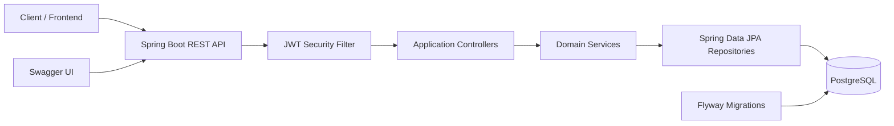

# Hamro Chalchitraghar Backend

## Reporting 1 business dashboard

ADMIN users can query `GET /api/admin/reports/dashboard`, `/dashboard/bookings`, and
`/dashboard/revenue` under `/api/admin/reports`. These database-aggregated APIs report booking,
revenue, registered-customer, active-movie, running-show, and scheduled-show KPIs. API dates are
inclusive local dates evaluated as `[startDate 00:00, endDate + 1 day 00:00)` in `app.time-zone`.
Revenue includes completed `SUCCESS` and `REFUNDED` payments, subtracts only `SUCCEEDED` refunds,
and remains separated by currency. Occupancy, trends, rankings, exports, scheduled reports, and
reporting caches remain deferred.

## Reporting 2 analytical reports

ADMIN reporting now also includes detailed revenue and booking trends grouped by day, ISO week, or
month; generated-seat occupancy; and paginated movie, hall, and show performance. Performance is
selected by show date, excludes cancelled shows by default, counts distinct seats on confirmed
bookings, and aggregates payments and refunds independently by currency. Supported endpoints expose
typed filtering, stable sorting, and bounded pagination under `/api/admin/reports`.

Refund-1 provides a database-backed full-refund intent foundation. Trusted internal callers can
create idempotent `REQUESTED` intents for eligible successful payments; customer APIs expose only
refunds owned through the authenticated user's bookings, while ADMIN APIs provide sanitized
system-wide reads. A refund intent reserves refundable balance but does not return money, change a
payment or booking, revoke a ticket, contact eSewa, or run asynchronously. Partial refunds,
customer request mutations, cancellation integration, approval, and processing remain deferred.


Hamro Chalchitraghar Backend is a Spring Boot REST API for a cinema ticket booking system. It provides public movie, hall, show, and seat browsing; JWT authentication; customer booking and seat hold workflows; staff booking lookup; and admin management for movies, halls, seat layouts, shows, and users.

The implementation is a modular monolith: one deployable Spring Boot application organized into domain modules with controller, service, repository, mapper, DTO, entity, and shared infrastructure layers.

## Features

| Area | Current implementation |
| --- | --- |
| Authentication | Register, login, and refresh JWT tokens |
| Authorization | Role-based access for CUSTOMER, STAFF, and ADMIN |
| Public catalog | Browse movies, halls, shows, and show seats |
| Admin catalog | Create, update, soft-delete, and list movies, halls, and shows |
| Seat layout | Generate standard hall seat templates and show seats |
| Seat hold | Lock seats for 10 minutes before booking |
| Booking | Create, confirm, cancel, and list customer bookings |
| Staff | Lookup bookings by ID |
| Persistence | PostgreSQL schema managed by Flyway |
| API docs | Swagger UI through springdoc-openapi |
| Tests | Spring Boot integration tests with MockMvc and H2 |
| Deployment | Multi-stage Dockerfile and Docker Compose with PostgreSQL |

## Technology Stack

| Layer | Technology |
| --- | --- |
| Language | Java 21 |
| Framework | Spring Boot 3.5.9 |
| Web | Spring MVC |
| Security | Spring Security, JWT with JJWT |
| Persistence | Spring Data JPA, Hibernate |
| Database | PostgreSQL 16 |
| Migration | Flyway |
| Validation | Jakarta Bean Validation |
| Documentation | springdoc-openapi Swagger UI |
| Testing | JUnit 5, Spring Boot Test, MockMvc, H2 |
| Build | Maven Wrapper |
| Runtime | Docker, Eclipse Temurin 21 |

## Architecture Overview



The code separates external API surfaces under `applications`, domain logic under `modules`, and common infrastructure under `shared`.

## Project Structure

```text
src/main/java/com/chalchitraghar
├── applications
│   ├── admin
│   ├── auth
│   ├── customer
│   ├── publicapi
│   └── staff
├── modules
│   ├── auth
│   ├── bookings
│   ├── halls
│   ├── movies
│   ├── seats
│   ├── shows
│   └── users
└── shared
    ├── config
    ├── exception
    ├── response
    └── security
```

## Installation

Requirements:

- Java 21
- Maven Wrapper from this repository
- PostgreSQL 16 for local development
- Docker and Docker Compose for containerized execution

Clone the repository and install dependencies:

```bash
./mvnw clean test
```

On Windows PowerShell:

```powershell
.\mvnw.cmd clean test
```

## Environment Variables

The application reads configuration from Spring profiles and environment variables.

| Variable | Required in prod | Default in dev | Description |
| --- | --- | --- | --- |
| `SPRING_PROFILES_ACTIVE` | No | `dev` | Active Spring profile |
| `DB_URL` | Yes | `jdbc:postgresql://localhost:5432/hamro_chalachitraghar_db` | JDBC URL |
| `DB_USERNAME` | Yes | `postgres` | Database username |
| `DB_PASSWORD` | Yes | `Himal123!` | Database password |
| `JWT_SECRET` | Yes | Development secret in `application-dev.yaml` | HS256 signing secret, at least 32 characters recommended |
| `JWT_EXPIRATION_MS` | No | `3600000` | JWT lifetime in milliseconds |
| `CORS_ALLOWED_ORIGINS` | Yes in prod | `http://localhost:4200` | Comma-separated allowed origins |

Use `.env.example` as the local template.

## Running Locally

Start PostgreSQL, create the database, and run:

```bash
./mvnw spring-boot:run
```

The API runs on:

```text
http://localhost:8080
```

Flyway runs automatically at startup and applies SQL migrations from `src/main/resources/db/migration`.

## Docker

Run the backend and PostgreSQL together:

```bash
docker compose up --build
```

Services:

| Service | Port | Description |
| --- | --- | --- |
| `postgres` | `5432` | PostgreSQL 16 database |
| `app` | `8080` | Spring Boot backend |

The Docker image is built with a multi-stage Dockerfile using Eclipse Temurin 21.

## Swagger

Swagger UI:

```text
http://localhost:8080/swagger-ui/index.html
```

OpenAPI JSON:

```text
http://localhost:8080/v3/api-docs
```

## Authentication

Authentication uses JWT bearer tokens.

1. Register with `POST /api/auth/register`.
2. Login with `POST /api/auth/login`.
3. Send authenticated requests with:

```http
Authorization: Bearer <token>
```

Access rules:

| Route prefix | Access |
| --- | --- |
| `/api/auth/**` | Public |
| `/api/public/**` | Public |
| `/api/customer/**` | CUSTOMER, STAFF, ADMIN |
| `/api/staff/**` | STAFF, ADMIN |
| `/api/admin/**` | ADMIN |
| `/swagger-ui/**`, `/v3/api-docs/**` | Public |

## Testing

Run all tests:

```bash
./mvnw test
```

The test profile uses H2 in PostgreSQL compatibility mode with Flyway disabled and validates authentication, authorization, catalog management, show scheduling, seat generation, seat holds, and booking lifecycle behavior.

## Observability

Spring Boot Actuator exposes status-only health endpoints at `/actuator/health`,
`/actuator/health/liveness`, and `/actuator/health/readiness`. Liveness reports application process
state; readiness also requires the database because core booking operations depend on it. The compatibility
endpoint `/api/public/health` remains available but proves only HTTP/controller responsiveness.

`/actuator/info` and `/actuator/prometheus` require an ADMIN JWT. Prometheus exports built-in HTTP,
JVM, process, datasource, and Hikari metrics; custom business metrics are deferred. Only `health`, `info`,
and `prometheus` are exposed. Graceful shutdown allows a bounded 30-second drain, and Docker checks the
readiness endpoint.

## API Overview

| Group | Endpoints |
| --- | --- |
| Auth | Register, login, refresh token |
| Public | Health, movies, halls, shows, seats |
| Customer | Profile, hold seats, create booking, confirm booking, cancel booking, list my bookings |
| Staff | Booking lookup |
| Admin | Movie CRUD, hall CRUD, seat layout generation, show CRUD, user lookup |

Full endpoint documentation is in [docs/API.md](docs/API.md).

## Folder Structure

| Path | Purpose |
| --- | --- |
| `src/main/java/com/chalchitraghar/applications` | REST controllers grouped by API audience |
| `src/main/java/com/chalchitraghar/modules` | Domain modules and business logic |
| `src/main/java/com/chalchitraghar/shared` | Security, response wrapper, exceptions, configuration, base entity |
| `src/main/resources/db/migration` | Flyway SQL migrations |
| `src/test/java/com/chalchitraghar` | Integration tests |
| `.github/workflows/ci.yml` | GitHub Actions test workflow |
| `docs` | Project documentation |

## Screenshots Placeholders

Add screenshots here when the backend is demonstrated in a portfolio:

| Screenshot | Placeholder |
| --- | --- |
| Swagger UI | `docs/screenshots/swagger-ui.png` |
| Authentication response | `docs/screenshots/auth-response.png` |
| Booking flow | `docs/screenshots/booking-flow.png` |
| Docker running services | `docs/screenshots/docker-services.png` |

## Contributing

1. Create a feature branch.
2. Keep changes scoped to one module or workflow.
3. Add or update integration tests for API behavior.
4. Run `./mvnw clean test`.
5. Open a pull request with a clear summary and verification notes.

See [docs/MAINTENANCE.md](docs/MAINTENANCE.md) for developer workflow details.

## License

No license file is currently present in the repository.

## Refund-2 workflow

Customers can atomically cancel an eligible confirmed paid booking and create a `REQUESTED`
full-refund intent. Show cancellation cancels confirmed paid bookings and creates `APPROVED` intents;
admins can create, approve, or reject intents. Checked-in tickets block automatic flows, and safe
notifications/audits run after commit. Payment remains `SUCCESS`; provider execution and financial
completion remain Refund-3 work.
Refund processing is manual-first and database-backed: approved refunds are claimed into `PROCESSING`, recorded as append-only attempts, and finalized only after confirmed success. Manual/provider-unsupported execution enters `MANUAL_REVIEW`; an ADMIN may record verified manual completion, which atomically moves the refund to `SUCCEEDED` and its full payment from `SUCCESS` to `REFUNDED`. No speculative eSewa refund endpoint is used.
Refund administration now includes combined operational filtering, explicit manual-review resolution, targeted stale-claim recovery, per-refund financial consistency diagnostics, currency-separated summary reporting, and opt-in bounded anonymization. The final module remains full-refund-only and ADMIN financial controls remain centralized under `/api/admin/**`.

## Observability-2 metrics

Custom `chalchitraghar.*` metrics cover booking, seat-lock, payment, ticket, notification, email,
audit, refund, scheduled-job, and notification-executor activity through the protected Prometheus scrape.
Tags use only fixed operations, outcomes, jobs, and executor names; customer and business identifiers are
prohibited. Scheduled-job last-success timestamps are in-memory and reset when the process restarts.

## Observability-3 logging

Development and test profiles write readable correlation-aware console logs. The `prod` profile writes ECS-compatible structured JSON to stdout using Spring Boot's native encoder. Scheduled jobs use isolated run correlation IDs and emit one completion or failure summary. Logs exclude request bodies, credentials, tokens, OTPs, provider payloads, email content, and QR data; collection remains a deployment concern.

## Observability-4 monitoring stack

The optional Compose overlay provisions pinned Prometheus and Grafana services, bounded persistent retention, five version-controlled dashboards, and actionable alert rules. Create the ignored scrape secret and set `GRAFANA_ADMIN_PASSWORD`, then run `docker compose -f docker-compose.yml -f docker-compose.observability.yml up --build`. Prometheus and Grafana bind to loopback ports 9090 and 3000 by default; anonymous Grafana is disabled. See `monitoring/README.md` for dashboards, initial SLOs, security, validation, synthetic readiness, capacity guidance, and runbooks. Prometheus is operational telemetry, not financial reporting.
# Reporting 3

ADMIN reporting now supports formula-safe CSV and XLSX exports, previous/custom-period comparisons, movie and hall comparisons, and persistent daily/weekly/monthly report schedules. Scheduled delivery uses completed local periods, bounded retries, attachment email delivery, and a unique deterministic delivery key.
# Reporting 4

The completed reporting module now includes explainable booking-pattern, show-time, seat-utilization, aggregate customer, conversion, refund, revenue-concentration, performance-extreme, and compact data-quality analytics. All business analytics are ADMIN-only, timezone-aware, currency-isolated, and backed by bounded aggregate queries.
