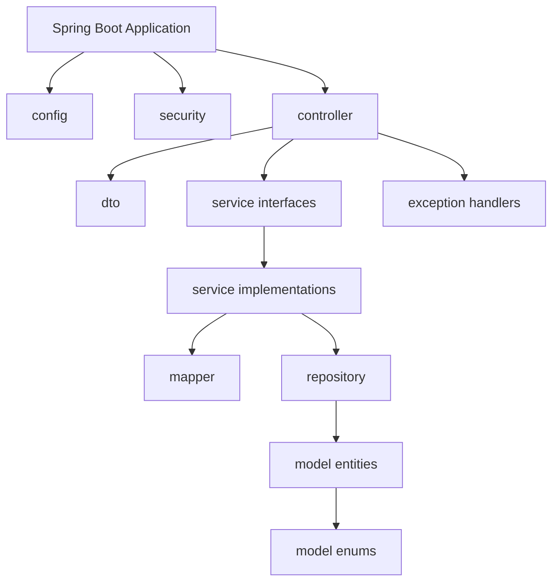
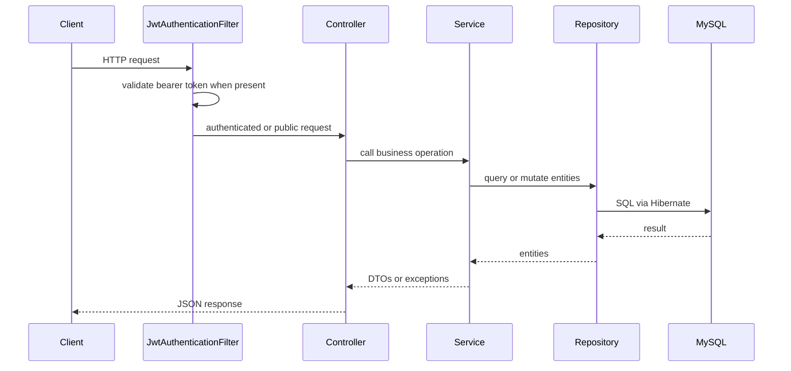

# Architecture

## Repository Structure

```text
hamro-chalchitraghar-backend/
  pom.xml
  mvnw
  mvnw.cmd
  POSTMAN_COLLECTION.md
  PROJECT_REPORT.md
  PROJECT_STRUCTURE.txt
  src/
    main/
      java/com/chalchitraghar/
        HamroChalchitragharBackendApplication.java
        config/
        controller/
        dto/
        exception/
        mapper/
        model/
        repository/
        security/
        service/
      resources/
        application.yaml
    test/
      java/com/chalchitraghar/
        HamroChalchitragharBackendApplicationTests.java
```

No `.github`, Docker, migration, or seed-data directory was found.

## Component And Module Map



## Dependency Relationships

- Controllers depend on service interfaces and DTO classes.
- Services depend on repositories, mappers, entities, and custom exceptions.
- Repositories depend on JPA entities and Spring Data JPA.
- Mappers depend on entities and response DTOs.
- Security filter depends on `JwtUtil` and `UserRepository`.
- Auth service depends on `UserService`, `BCryptPasswordEncoder`, and `JwtUtil`.

## Important Design Patterns

- Layered architecture: Controller -> Service -> Repository.
- DTO boundary: controllers accept request DTOs and return response DTOs.
- Manual mapping: mapper components convert entities to DTOs.
- Repository pattern: Spring Data JPA interfaces encapsulate persistence.
- Soft delete by status: movies become `ENDED`, halls become `INACTIVE`, shows become `CANCELLED`.
- Stateless auth: JWT bearer token per request.
- Pessimistic locking: seat rows are selected with `PESSIMISTIC_WRITE` during booking-sensitive operations.
- Centralized exception handling: `@RestControllerAdvice` builds structured error responses.

## External Integrations

Implemented:

- MySQL database through JDBC and Spring Data JPA.
- Angular/local frontend origin through CORS: `http://localhost:4200`.

Not implemented / Unknown:

- Payment provider: Unknown / needs confirmation.
- Email/SMS notification provider: Unknown / needs confirmation.
- Object storage/CDN for poster images: poster URL is stored as a string only.
- Monitoring/log aggregation: Unknown / needs confirmation.
- CI/CD platform: Unknown / needs confirmation.

## Runtime Request Path


