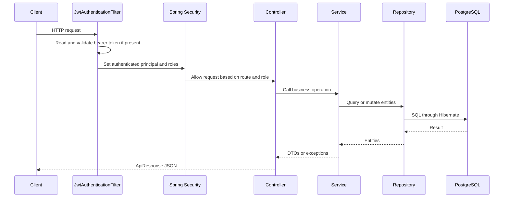

# Architecture

## Overview

Hamro Chalchitraghar backend V2 is a modular monolith built with Spring Boot 3.x and Java 21.

The application is deployed as one Spring Boot service, but code is organized by business module and application boundary:

- `modules/*`: core domain logic, DTOs, repositories, services, mappers, and entities.
- `applications/*`: HTTP controllers grouped by caller role.
- `shared/*`: cross-cutting infrastructure such as security, configuration, exception handling, and standard responses.

## Package Structure

```text
src/main/java/com/chalchitraghar/
  HamroChalchitragharBackendApplication.java

  applications/
    auth/
    publicapi/
    customer/
    staff/
    admin/

  modules/
    auth/
    users/
    movies/
    halls/
    shows/
    seats/
    bookings/

  shared/
    config/
    exception/
    response/
    security/
```

Important shared classes:

- `shared/config/SecurityConfig.java`
- `shared/security/JwtAuthenticationFilter.java`
- `shared/security/JwtUtil.java`
- `shared/exception/GlobalExceptionHandler.java`
- `shared/response/ApiResponse.java`

## Request Flow



## Controller Groups

Controllers are separated by caller type:

- `applications/auth`: public auth endpoints under `/api/auth/**`.
- `applications/publicapi`: public browsing endpoints under `/api/public/**`.
- `applications/customer`: authenticated customer endpoints under `/api/customer/**`.
- `applications/staff`: staff endpoints under `/api/staff/**`.
- `applications/admin`: admin management endpoints under `/api/admin/**`.

This keeps public, customer, staff, and admin API surfaces explicit.

## Layering

The main flow is:

```text
Controller -> Service -> Repository -> Database
```

Responsibilities:

- Controllers validate request bodies, read path/query params, call services, and wrap success responses.
- Services contain business rules and transaction boundaries.
- Repositories are Spring Data JPA interfaces.
- Mappers convert entities to response DTOs.
- Entities define persistence structure.
- Exceptions are mapped centrally by `GlobalExceptionHandler`.

## Standard API Response

Most controller responses use:

```java
ApiResponse<T>
```

Shape:

```json
{
  "success": true,
  "message": "Success message",
  "data": {},
  "errors": []
}
```

Errors use the same shape with `success: false`, `data: null`, and `errors` as an array.

Security-level `401` and `403` failures also use this response shape.

## Security

Authentication is stateless JWT bearer authentication.

Security rules are centralized in `SecurityConfig`:

- `/api/auth/**`: public.
- `/api/public/**`: public.
- `/api/customer/**`: `CUSTOMER`, `STAFF`, or `ADMIN`.
- `/api/staff/**`: `STAFF` or `ADMIN`.
- `/api/admin/**`: `ADMIN`.
- Everything else: authenticated.

`JwtAuthenticationFilter`:

1. Reads `Authorization: Bearer <jwt>`.
2. Validates token signature and expiration.
3. Loads the user by email.
4. Adds a `ROLE_<role>` authority to the Spring Security context.
5. Returns standard `ApiResponse` errors for invalid or expired tokens.

## Database Startup

The application uses PostgreSQL and Flyway.

Startup flow:

1. Spring creates the datasource.
2. Flyway applies pending migrations from `src/main/resources/db/migration`.
3. Hibernate validates the schema because `ddl-auto` is `validate`.
4. Application startup continues only if schema validation passes.

## Booking Hold Flow

The booking flow separates temporary seat holds from booking creation.

1. Customer calls `POST /api/customer/bookings/hold`.
2. Service validates seat IDs and checks for duplicates.
3. Seats are loaded with pessimistic write locking.
4. Available seats become `LOCKED`.
5. Lock metadata is stored:
   - `locked_at`
   - `lock_expires_at`
   - `locked_by_user_id`
6. The same user can create a booking from held seats.
7. Booking creation changes seats to `RESERVED`.
8. Confirming the booking changes seats to `BOOKED`.
9. Cancelling an initiated booking changes seats back to `AVAILABLE`.

Expired locks are cleared when a seat hold or booking operation touches those seats. There is also an expired-lock cleanup job component in the seats module.

## Tests

Integration tests use:

- Spring Boot Test
- MockMvc
- Spring Security Test
- H2 in PostgreSQL compatibility mode
- `test` profile

Current coverage includes auth, public APIs, admin APIs, show validation, seat layout generation, booking flow, authorization, and standard error responses.

## External Integrations

Implemented:

- PostgreSQL database.
- JWT authentication.
- Configurable CORS origins.

Not implemented:

- Payment provider.
- Email or SMS notifications.
- Docker setup.
- CI/CD workflow.
- File storage for poster images.

Poster images are currently represented by a URL string only.
