# Architecture

Hamro Chalchitraghar Backend is a Spring Boot modular monolith. It is deployed as one application, but the code is organized by domain modules and API audience boundaries.

## Overall Architecture

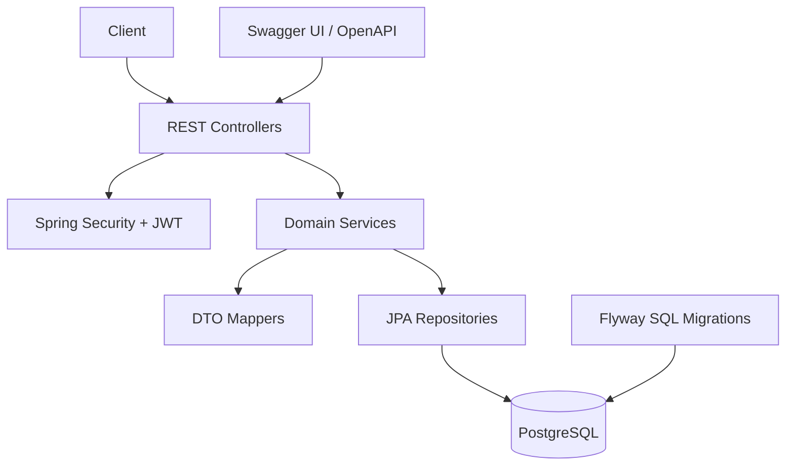

## Layered Architecture

| Layer | Packages | Responsibility |
| --- | --- | --- |
| Application/API | `com.chalchitraghar.applications.*` | HTTP routing, request validation, response wrapping |
| Domain modules | `com.chalchitraghar.modules.*` | Business behavior for auth, users, movies, halls, shows, seats, bookings |
| Persistence | `modules.*.repository` | Spring Data JPA access and custom locking queries |
| Mapping | `modules.*.mapper` | Entity-to-DTO and DTO-to-entity conversion |
| Shared infrastructure | `com.chalchitraghar.shared.*` | Security, exceptions, API response wrapper, base entity, OpenAPI config |
| Database migration | `src/main/resources/db/migration` | Versioned PostgreSQL schema migrations |

## Modular Monolith Structure

```text
com.chalchitraghar
├── applications
│   ├── auth
│   ├── publicapi
│   ├── customer
│   ├── staff
│   └── admin
├── modules
│   ├── auth
│   ├── users
│   ├── movies
│   ├── halls
│   ├── shows
│   ├── seats
│   └── bookings
└── shared
    ├── config
    ├── exception
    ├── response
    └── security
```

The `applications` package defines entry points by audience. The `modules` package contains reusable domain logic and persistence. This keeps endpoint authorization boundaries visible without splitting the backend into separate services.

## Controller to Service to Repository Flow

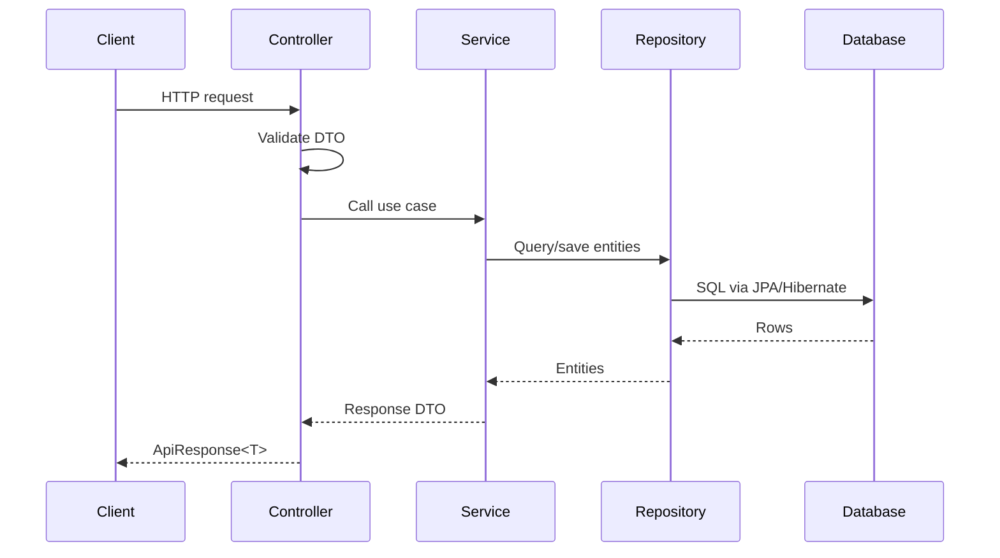

## DTO Flow

Request DTOs are validated with Jakarta Bean Validation in controller methods annotated with `@Valid`. Services receive validated DTOs and current user context where needed.

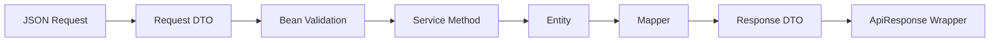

Important DTOs:

| DTO | Used by |
| --- | --- |
| `RegistrationRequest`, `LoginRequest`, `GoogleLoginRequest`, `RefreshTokenRequest`, `ForgotPasswordRequest`, `ResetPasswordRequest` | Auth |
| `MovieRequest`, `HallRequest`, `ShowRequest` | Admin management |
| `SeatHoldRequest`, `BookingRequest` | Customer booking workflow |
| `PublicMovieSummaryResponse`, `PublicMovieDetailResponse` | Public movie browsing responses |
| `AdminMovieSummaryResponse`, `AdminMovieDetailResponse` | Admin movie management responses |
| `MovieResponse` | Legacy movie response retained for compatibility |
| `PublicHallSummaryResponse`, `PublicHallDetailResponse` | Public hall browsing responses |
| `AdminHallSummaryResponse`, `AdminHallDetailResponse` | Admin hall management responses |
| `AdminSeatTemplateSummaryResponse`, `AdminSeatLayoutResponse` | Admin generated seat-template layout responses |
| `PublicShowSummaryResponse`, `PublicShowDetailResponse` | Public show browsing responses |
| `AdminShowSummaryResponse`, `AdminShowDetailResponse` | Admin show management responses |
| `SeatResponse`, customer/staff/admin booking responses | Audience-safe seat and booking API responses |

Booking lists use `BookingSearchCriteria`, `BookingSpecification`, and the shared `PageResponse<T>`. Customer history always adds the authenticated user's ID to the database specification. Staff and admin lists use separate summary DTOs and management routes; their case-insensitive search is limited to customer name/email, movie title, and hall name. Booking list seat codes are batch-loaded and ordered by concrete seat position.

`BookingReferenceGenerator` creates non-ID-derived customer references. `BookingLifecycleService` centralizes initiated-booking expiry and reserved-seat release. Booking creation snapshots each seat's `BigDecimal` price into `BookingSeat.unitPrice`, stores `Booking.totalAmount` and configured currency, and all booking mappers read those immutable values.

`ExpiredBookingCleanupJob` queries one configured page of due initiated bookings and delegates every transition to `BookingLifecycleService`, the same path used by lazy reconciliation. Booking mutations pessimistically lock the booking first and acquire seat locks in deterministic ID order. `PaymentAuthorizationService` is the single future gateway seam; `LocalPaymentAuthorizationService` is intentionally permissive. Refund-2 show cancellation rejects ambiguous pending/booked cases, cancels initiated bookings, and atomically cancels/refunds confirmed paid bookings.
| `UserResponse` | Authenticated customer profile response |
| `AdminUserSummaryResponse`, `AdminUserDetailResponse` | Admin user lookup responses |
| `PageResponse<T>` | Shared paginated list wrapper returned inside `ApiResponse<T>` |

User responses are intentionally split by audience. Customer profile endpoints use `UserResponse`, while admin user endpoints use `AdminUserSummaryResponse` for lists and `AdminUserDetailResponse` for detail lookup. None of these DTOs expose passwords, Google subject IDs, internal hashes, or OTP data.

Movie responses are also split by audience. Public movie endpoints use summary/detail DTOs that never expose audit timestamps. Admin movie list endpoints use a compact summary DTO, while admin create, update, and detail endpoints use `AdminMovieDetailResponse` with `createdAt` and `updatedAt`. Controllers delegate to `MovieService`; they do not map movie entities directly.

Movie list endpoints use `PageResponse<T>` and keep public/admin response contracts separate:

- `GET /api/public/movies` returns `PageResponse<PublicMovieSummaryResponse>` sorted by `releaseDate` ascending by default.
- `GET /api/admin/movies` returns `PageResponse<AdminMovieSummaryResponse>` sorted by `createdAt` descending by default.

Both movie list endpoints support case-insensitive search across `title`, `genre`, and `language`; optional filters for `status`, `genre`, `language`, `releaseDateFrom`, and `releaseDateTo`; and an allowlisted sort field set of `id`, `title`, `genre`, `language`, `releaseDate`, `status`, `createdAt`, `updatedAt`, and `durationMinutes`.

Movie create and update rules live in `MovieService`. The service rejects duplicate movies by case-insensitive `title` plus `releaseDate`, validates release date consistency for `UPCOMING`, `NOW_SHOWING`, and `ENDED`, and enforces the lifecycle `UPCOMING -> NOW_SHOWING -> ENDED` with the direct shortcut `UPCOMING -> ENDED`. The database also enforces duplicate protection through `movies.title_normalized` plus `release_date`.

Movie visibility is audience-specific. Public movie lists and detail endpoints expose only `UPCOMING` and `NOW_SHOWING`; `status=ENDED` is rejected on public lists and ended movie detail is returned as not found. Admin movie endpoints can list and fetch all statuses. Ending a movie, either through update or delete, is blocked when future active `SCHEDULED` or `RUNNING` shows still reference it. The service enforces this through `ShowRepository`; controllers do not duplicate dependency checks.

Hall responses are split by audience. Public hall list endpoints use `PublicHallSummaryResponse` and public hall detail uses `PublicHallDetailResponse`; neither public DTO exposes `layoutRef`, `createdAt`, or `updatedAt`. Public hall endpoints expose only `ACTIVE` halls, so inactive hall detail lookup returns not found. Admin hall list endpoints use `AdminHallSummaryResponse`, while admin create, update, and detail endpoints use `AdminHallDetailResponse` with audit timestamps. Admin endpoints can see both `ACTIVE` and `INACTIVE` halls.

Hall list endpoints use `PageResponse<T>` and keep public/admin response contracts separate:

- `GET /api/public/halls` returns `PageResponse<PublicHallSummaryResponse>` sorted by `name` ascending by default and always filters to `ACTIVE`.
- `GET /api/admin/halls` returns `PageResponse<AdminHallSummaryResponse>` sorted by `createdAt` descending by default and can filter by `ACTIVE` or `INACTIVE`.

Public hall search matches `name`. Admin hall search matches `name` and `layoutRef`. Both hall list endpoints use the same allowlisted sort fields: `id`, `name`, `capacity`, `layoutRef`, `status`, `createdAt`, and `updatedAt`.

Hall create and update rules live in `HallService`. The service trims `name` and `layoutRef`, rejects duplicate hall names case-insensitively, validates status changes through the `ACTIVE <-> INACTIVE` lifecycle, and returns duplicate-name conflicts as `409`. Request validation enforces capacity from `1` to `1000` and requires `layoutRef` to be at most `100` characters using only letters, numbers, hyphen, and underscore. The database reinforces duplicate protection through a normalized unique index on `lower(trim(name))`.

Hall inactivation is safe by default. Admin delete remains a soft delete that sets `status=INACTIVE`, and update can also inactivate a hall, but both paths are blocked when future active `SCHEDULED` or `RUNNING` shows still reference the hall. Once seat templates exist, `capacity` and `layoutRef` are immutable so generated show seats remain consistent with the original layout; `name` and `status` can still change subject to lifecycle and dependency rules. Seat layout generation stays fixed at 188 templates and requires an existing `ACTIVE` hall with `capacity=188` and no previous templates.

Generated templates have a dedicated admin contract. `GET /api/admin/halls/{hallId}/seat-layout` returns `AdminSeatLayoutResponse`, including hall metadata, filtered totals, category counts, distinct rows, and `AdminSeatTemplateSummaryResponse` entries. The service owns case-insensitive seat-code/row search, exact seat-type and row filters, and allowlisted sorting; these options can be combined. A missing hall or a hall without generated templates returns `404`.

Fixed layout generation follows a build-validate-persist workflow. The service constructs all templates in rendering order, the `SeatTemplateValidator` verifies row, numbering, generated-code, category, position, uniqueness, and capacity invariants, and the repository persists the validated collection with one `saveAll` call inside the generation transaction. Database unique constraints repeat the critical identity guarantees for both hall templates and show seats. `SeatPricingPolicy` is the authoritative mapping of `PREMIUM` to `750.0` and `PLATINUM` to `500.0`.

Templates are read-only and generation is one-time by default. Explicit regeneration is allowed only when the hall is active, uses the supported capacity, already has templates, and has no shows of any status. Show seats are snapshots: they are bulk-cloned only after template count and integrity validation. A show cannot change halls after seats or bookings exist, and no automatic regeneration occurs.

Show status controls seat visibility rather than mutating every historical seat. Public seat retrieval returns `404` for missing, cancelled, or completed shows and transactionally clears expired locks before mapping public DTOs. Holds and booking creation reject cancelled/completed shows. Cancelling a show retains its seats, and `SeatStatus.CANCELLED` is currently unused.

Show reads are audience-specific. Public show lists use `PublicShowSummaryResponse`, public detail uses `PublicShowDetailResponse`, and both hide cancelled/completed shows plus shows linked to a non-`NOW_SHOWING` movie or inactive hall. Admin lists use `AdminShowSummaryResponse` and admin detail/create/update use `AdminShowDetailResponse`; admin reads include every show status and historical movie/hall associations. `ShowService` exposes separate public and admin read methods, while `ShowMapper` owns all audience-specific response construction.

Show list endpoints return `PageResponse<T>` and use `ShowSpecification` so visibility, case-insensitive movie-title/hall-name search, and combinable filters are applied before pagination. Public lists filter by movie, hall, and show date; admin lists additionally filter by show status. Both allow sorting by `showDate`, `showTime`, `endTime`, `status`, `createdAt`, or `updatedAt`, with `showDate` ascending as the default.

Show scheduling rules live in `ShowService`. Creation and scheduled-show updates reject past start instants, non-positive or overnight intervals, and end times more than the configured tolerance (five minutes by default) from `showTime + movie.durationMinutes`. Hall availability expands candidate intervals by the configured cleaning buffer (`SHOW_BUFFER_MINUTES`, default 15); cancelled shows do not participate. The explicit lifecycle is `SCHEDULED -> RUNNING -> COMPLETED`; completed and cancelled shows are terminal, and running shows accept status changes only.

`ShowLifecycleService` is the authority for effective status and booking eligibility using the configured application `Clock` (`APP_TIME_ZONE`, default `Asia/Kathmandu`). Public reads reconcile stale statuses and show future scheduled plus currently running shows; ended shows are hidden. `ShowStatusReconciliationJob` persists forward-only scheduled-to-running and running-to-completed changes every configured interval. Holds, booking creation, and confirmation all require an effectively scheduled future show with an active hall and now-showing movie.

Show update/cancellation paths lock the show row and run transactionally. Any active hold or active booking makes the schedule immutable. Cancellation is blocked by active bookings, rejected for running/completed shows, and idempotent for already-cancelled shows. When allowed, it releases active locks while retaining concrete seat snapshots.

Public `SeatResponse` remains separate because it represents a concrete, priced, availability-bearing seat for one show rather than a reusable hall template. `GET /api/public/shows/{showId}/seats` intentionally remains non-paginated and position-ordered because auditorium rendering requires the complete seat map in one response.

Admin user lists use `PageResponse<AdminUserSummaryResponse>` and support bounded pagination, allowlisted sorting, case-insensitive search across `name` and `email`, and optional filters for role, auth provider, enabled, locked, and email verification state.

Admin user lifecycle and account state management is implemented in `UserService` and exposed through thin `AdminUserController` endpoints:

- `POST /api/admin/users` creates internal `LOCAL` users with BCrypt passwords and roles `CUSTOMER`, `STAFF`, or `ADMIN`.
- `PUT /api/admin/users/{id}` updates only `name`, `role`, `enabled`, and `emailVerified`.
- `PUT /api/admin/users/{id}/enable` sets `enabled=true`.
- `PUT /api/admin/users/{id}/disable` sets `enabled=false` and rejects self-disable.
- `PUT /api/admin/users/{id}/lock` sets `locked=true` and `lockedUntil=null` for a manual lock, and rejects self-lock.
- `PUT /api/admin/users/{id}/unlock` sets `locked=false`, clears `lockedUntil`, and resets `failedLoginAttempts=0`.

Role updates are parsed through the `Role` enum so future roles can be handled centrally. The service rejects self-demotion from `ADMIN` and uses `UserRepository.countByRoleAndEnabledTrue(Role.ADMIN)` to prevent disabling, locking, or demoting the last enabled admin. Delete, bulk operations, impersonation, CSV import, and audit logging are intentionally outside this flow.

## Mapper Flow

Mappers are Spring components and convert between entities and DTOs:

| Mapper | Responsibility |
| --- | --- |
| `MovieMapper` | Movie request mapping plus public/admin summary and detail response mapping |
| `HallMapper` | Hall request mapping plus public/admin summary and detail response mapping |
| `SeatTemplateMapper` | Seat-template summaries and complete admin hall-layout responses |
| `ShowMapper` | Public/admin show summary and detail mapping using audience-safe nested movie and hall DTOs |
| `SeatMapper` | Seat entity to public seat response |
| `BookingMapper` | Booking response with selected seats and total price |
| `UserMapper` | User profile, admin user summary, and admin user detail responses |

## Specification Queries

Flexible admin user search is implemented with Spring Data JPA `Specification` through `UserSpecification`. Movie list search uses the same pattern through `MovieSpecification`, and hall list search uses `HallSpecification`. Services validate sort fields, sort direction, enum filters, and date ranges before building the `PageRequest`, then map the resulting `Page<Entity>` to the appropriate `PageResponse<T>`.

## Authentication Flow

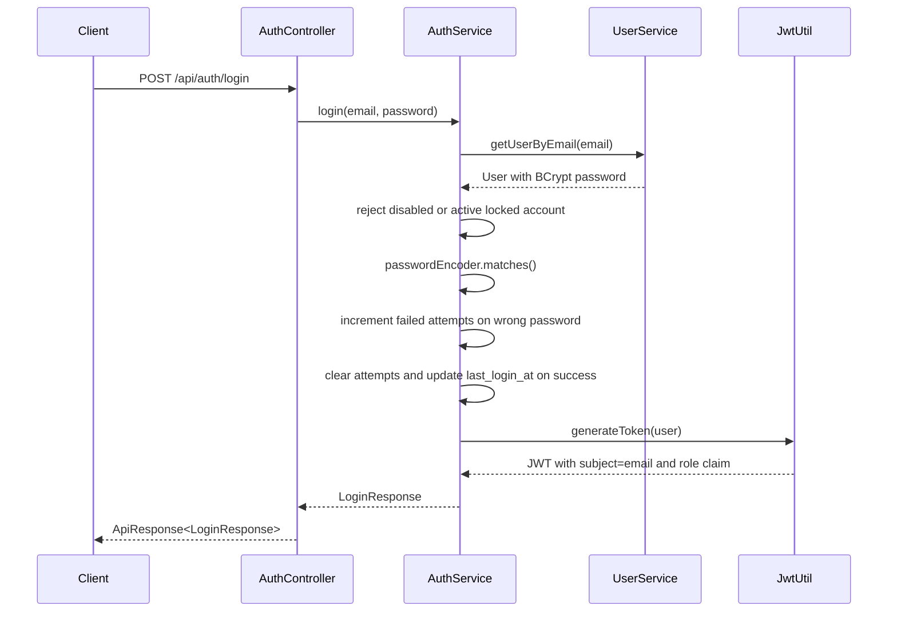

`JwtAuthenticationFilter` extracts `Authorization: Bearer <token>`, validates the token, loads the user by email, rejects disabled or locked users, rejects tokens issued before `password_changed_at`, and sets Spring Security authentication with `ROLE_<role>`.

Account lockout rules:

- Local password failures increment `failed_login_attempts`.
- 5 failed attempts set `locked=true` and `locked_until` to 15 minutes in the future.
- Manual admin locks set `locked=true` with `locked_until=null`; these locks remain active until an admin unlocks the account.
- Admin unlock clears `locked`, `locked_until`, and `failed_login_attempts`, whether the lock came from automatic failed-login lockout or manual action.
- Active locks reject local and Google login with a clean `ApiResponse` error.
- Expired locks are cleared on the next successful login.
- Successful local or Google login resets failed attempts and updates `last_login_at`.
- Google token verification failures do not increment local password failure counters.
- `enabled=false` prevents local login, Google login, and protected endpoint access with existing tokens.
- Registration, password change, and OTP password reset update `password_changed_at`; old JWTs are rejected after that timestamp.

## Google Authentication Flow

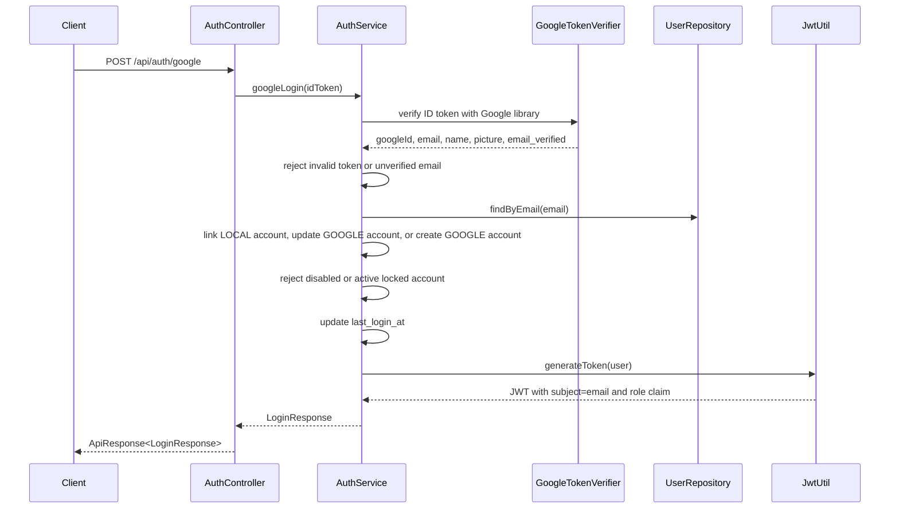

Google authentication keeps the existing JWT format unchanged: subject is the user email and the `role` claim is the role name. Existing local accounts are linked only when Google reports a verified email, and the local BCrypt password is preserved. Google-only accounts store no password and password login returns `This account uses Google Sign-In.`.

## Password Reset Flow

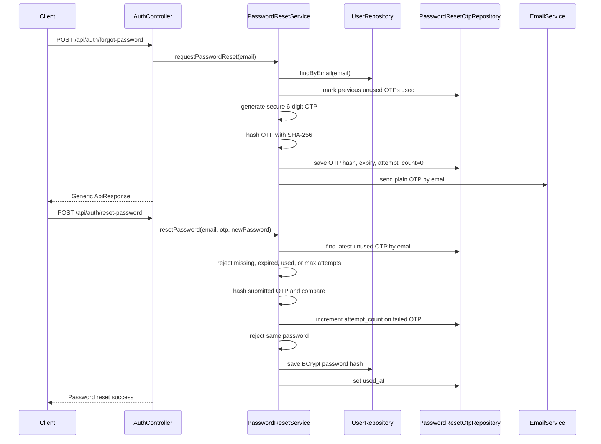

Password reset OTPs are one-time-use and expire after 10 minutes by default. The database stores only `otp_hash`; plain OTPs exist only in the email message and incoming reset request. Only the latest unused OTP for a user is accepted, and failed OTP verification increments `attempt_count` up to the configured maximum. Forgot-password responses are intentionally generic so callers cannot enumerate accounts by email.

## Authorization Flow

Authorization is centralized in `SecurityConfig`.

| Matcher | Access |
| --- | --- |
| `/swagger-ui.html`, `/swagger-ui/**`, `/v3/api-docs/**` | Public |
| `/api/auth/**` | Public |
| `/api/public/**` | Public |
| `/api/customer/**` | CUSTOMER, STAFF, ADMIN |
| `/api/staff/**` | STAFF, ADMIN |
| `/api/admin/**` | ADMIN |
| Other requests | Authenticated |

Controllers do not use `@PreAuthorize`; route-level access is controlled by request matchers.

## Booking Flow

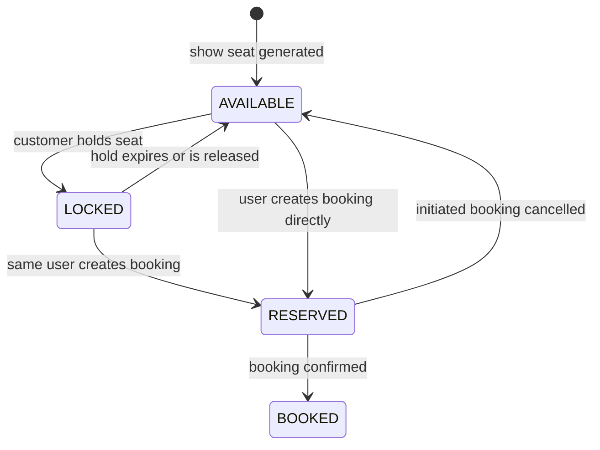

Booking entity statuses used by the code:

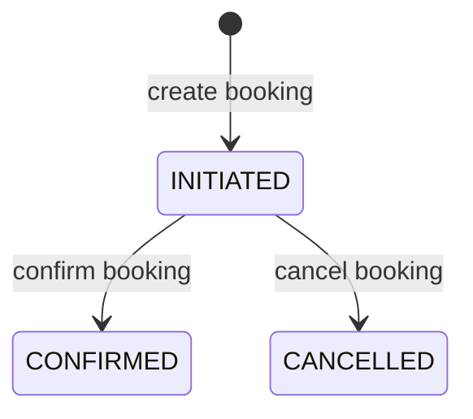

`BookingStatus` also defines `PENDING`, `BOOKED`, and `EXPIRED`, but the current service workflow creates `INITIATED`, confirms to `CONFIRMED`, and cancels to `CANCELLED`.

## Seat Hold Flow

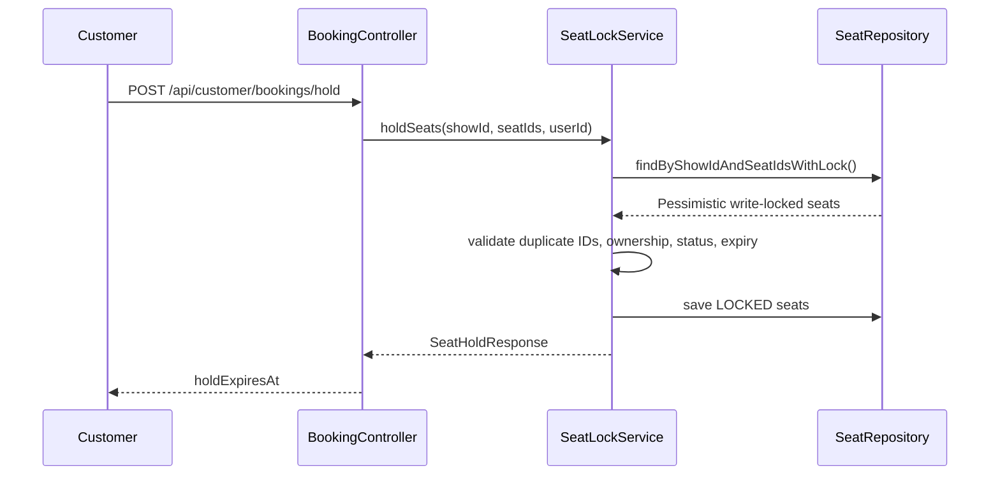

Seat holds last 10 minutes. `ExpiredSeatLockCleanupJob` runs every 60 seconds and releases expired `LOCKED` seats.

## Flyway Startup

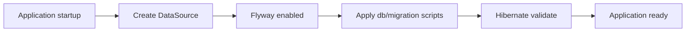

The main profile uses PostgreSQL with `spring.jpa.hibernate.ddl-auto=validate`. Schema changes are expected to be made through Flyway migrations.

## Docker Architecture

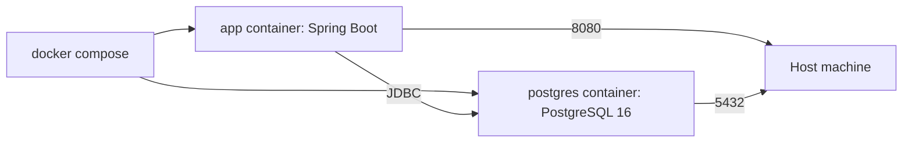

The Dockerfile builds the application with Maven in a JDK image, then runs the packaged jar in a smaller JRE image.

## Request Lifecycle

1. Client sends HTTP request.
2. CORS and Spring Security filters run.
3. JWT filter validates bearer token if present.
4. Security matchers authorize the route.
5. Controller binds path/query/body parameters.
6. Bean Validation validates request DTOs.
7. Service executes the business use case in a transaction when needed.
8. Repository reads or writes entities.
9. Mapper returns DTOs.
10. Controller wraps response in `ApiResponse<T>`.
11. `GlobalExceptionHandler` converts exceptions into standard error responses.
## Payments Module (Payment-1)

`modules/payments` owns the payment aggregate, enums, persistence, reference generation, audience-specific read service, and centralized mapper. Controllers remain separated under customer, staff, and admin application packages. Customer, staff, and admin DTOs are deliberately distinct even where their current shapes overlap.

One booking may have many payment attempts. The domain defines placeholder lifecycle states and providers, but Payment-1 has no initiation, provider calls, callbacks, cash collection, verification, refund processing, reconciliation, or automatic booking confirmation. Existing `PaymentAuthorizationService` and its permissive local implementation remain unchanged until a later phase.

Customer reads always constrain results to the authenticated booking owner and obscure non-owned references as `404`. Staff and admin reads expose safe operational identity fields under their existing route policies.

Payment-2 adds `PaymentLifecycleService` as the transition authority and `PaymentProviderAdapter` as the provider boundary. `LocalPaymentProviderAdapter` performs no I/O and advances new attempts from `CREATED` to `PENDING`. Initiation locks the booking row to serialize the one-active-attempt rule and persists server-authoritative booking amount/currency. Future external adapter calls must occur after the validating transaction commits so database locks are never held during network I/O.

Implemented transitions are `CREATED -> PENDING/CANCELLED/EXPIRED` and `PENDING -> SUCCESS/FAILED/EXPIRED/CANCELLED`; terminal states cannot reopen. `REFUNDED` remains reserved. Payment success and booking confirmation remain separate aggregates and workflows.
Payment-3 splits verification into an unlocked provider-I/O stage and a short transactional finalization stage. `EsewaSignatureService` owns canonical HMAC-SHA256 signing, `EsewaStatusClient` owns status enquiry, and `EsewaPaymentFinalizer` locks payment, booking, and seats only after provider I/O completes. Browser redirects are not trusted as webhooks.
Payment-4 adds bounded reconciliation and expiry jobs. Each provider reconciliation delegates independently, and finalization retains its own short transaction. Provider/network errors leave payments pending for later recovery. `PaymentOperationsService` supplies admin search, manual-review resolution, metrics, and consistency diagnostics. Refund types and persistence are intentionally inert extension points.
## Tickets Module

`modules/tickets` owns ticket persistence, reference generation, issuance, audience-specific mapping, and reads.
`TicketIssuanceService` locks/reloads a confirmed booking, validates that every claimed seat is `BOOKED`, orders
claims by seat position, and idempotently creates one ticket per booking seat. Customer confirmation and verified
eSewa finalization call the same service inside their confirmation transactions. Financial success left in manual
review does not issue tickets. An internal idempotent backfill method is available for confirmed development data.

Customer, staff, and admin controllers expose separate response contracts. Customer ownership is enforced during
repository lookup. Ticket-1 is read-only after issuance; QR and admission workflows are deferred to Ticket-2.

Ticket-2 uses `QrTokenService` for 256-bit URL-safe opaque tokens and SHA-256 hashes,
`QrTokenEncryptionService` for AES-256-GCM authenticated encryption with a random 96-bit IV, and `QrImageService`
for ZXing PNG rendering with error correction H. The ciphertext structure is versioned and authenticated with the
configured key ID as associated data. Issuance stores ciphertext and hash atomically; authorized QR retrieval
decrypts transiently and renders on demand. No domain information is encoded in the QR.

Ticket-3 admission hashes the submitted opaque token and performs a pessimistic-write lookup by hash. Within one
transaction it validates terminal ticket state, confirmed booking state, show cancellation, and the configured
entry/grace window. The first valid scan writes `CHECKED_IN`, `checkedInAt`, and `checkedInBy` and records a
`SUCCESS`; a concurrent or repeated scan observes the committed terminal state and records `ALREADY_USED`.
`TicketValidation` is the operational history for this workflow rather than the future general audit-log module.

Ticket-4 adds locked revocation and QR rotation, batched expiry reconciliation, OpenPDF in-memory ticket/bundle
rendering, and after-commit delivery events. `TicketDelivery` supplies the idempotency boundary of one issuance email
per booking/channel; retries never touch a sent record. Search specifications apply customer ownership inside the
database query and expose only allowlisted sort fields. Metrics aggregate ticket states and validation outcomes, and
the consistency service reports broken relationships without destructive auto-repair.
# Notifications module (Notification-1)

`modules/notifications` owns the entity, enums, DTOs, mapper, specification, repository, and service.
`applications/customer/NotificationController` is a thin authenticated adapter. Although the shared
customer route policy also permits staff and admin roles, every repository lookup includes the
authenticated principal's user ID, so those roles can see only notifications owned by their own
accounts.

Internal trusted code can call `NotificationService.createInAppNotification`. Creation validates
display fields and JSON payload, forces channel `IN_APP`, uses the injected application `Clock`, and
reuses an existing `(user,eventKey,channel)` row. Database uniqueness resolves concurrent creation.
No controller exposes creation.

Customer lists use specifications for combined filters and stable `occurredAt/id` pagination.
Detail reads do not alter state. Mark-read preserves the original `readAt`; read-all performs one
owner/channel-bound bulk update with one clock timestamp. DTO mapping excludes user identity and
event keys.

Publishing business events and automatically creating notifications are explicitly deferred to
Notification-2. Email, async delivery, retries, reminders, preferences, admin/staff APIs, and
historical backfill are not part of Notification-1.
# Notification-2 event flow

```text
Authoritative business transition
  -> publish immutable typed event in the transaction
  -> transaction commits
  -> @TransactionalEventListener(AFTER_COMMIT)
  -> NotificationContentFactory
  -> idempotent IN_APP notification persistence
```

Events carry IDs, public references, display-safe context, and an `occurredAt` value from the
injected application `Clock`; they never carry JPA entities or credentials. The centralized content
factory owns notification type, deterministic key, text, and minimal JSON payload. Persistence
failure is safely logged after commit and cannot reverse the business transition. Delivery uses
in-memory Spring events, so a process crash between commit and listener completion can lose a
notification; a transactional outbox is the recommended future durability upgrade. Email remains
deferred to Notification-3, and the existing ticket-email event flow is unchanged.

## Notification-3 delivery flow

## Notification-4 operational flow

```text
Reminder job -> eligible booking -> event -> notification -> preference -> email queue
Admin retry -> locked FAILED delivery -> dispatcher
Retention job -> bounded terminal/read selection -> anonymization
```

Admin DTOs mask recipients. Stale claims recover without resetting attempts. Retention preserves
type, status, timestamps, relationships, and event keys while removing customer content.


```text
AFTER_COMMIT listener -> IN_APP notification -> REQUIRES_NEW delivery row
    -> bounded notificationEmailExecutor -> transactional claim (PROCESSING)
    -> HTML render + SMTP outside the claim transaction
    -> REQUIRES_NEW SENT or FAILED/EXHAUSTED update
    -> bounded scheduled retry for due and stale claims
```

Pessimistic row locking and committed `PROCESSING` claims prevent immediate and retry workers from
sending the same row concurrently. Backoff is bounded and computed from the injected `Clock`.
Executor rejection leaves the persisted row recoverable. Ticket PDF delivery remains separate to
preserve attachments; password-reset OTP delivery remains separate to avoid delayed security-token
delivery. No broker or distributed lease is introduced.
# Audit module

`modules/audit` owns the immutable entity, trusted append command/service, allowlist validator,
repository/specification, mapper, and admin DTOs. The admin controller delegates reads through the
service and never exposes entities. Audit-2 supplies automatic application-event integration, Audit-3
supplies request/correlation context, and Audit-4 supplies export, reporting, retention anonymization,
and integrity verification.

Audit-4 flows are `admin export -> preflight range/count -> paged streaming query -> CSV sanitizer ->
response -> export audit`, `retention job -> bounded eligibility specification -> controlled anonymization`,
and `integrity request -> bounded immutable-field canonicalization -> mismatch counts`. A plain SHA-256 hash
detects accidental/casual corruption but is not tamper-proof against a privileged writer who can recompute it.
# Audit-2 event flow

Success follows `authoritative transaction -> immutable typed event -> commit -> AFTER_COMMIT
listener -> REQUIRES_NEW append`. Selected failures use sanitized events and isolated persistence
before the original exception continues. Events contain scalar snapshots, never entities; publishers
exist only at authoritative service/event boundaries to avoid controller duplication.
# Audit-3 context flow

`RequestAuditContextFilter -> immutable holder/MDC -> JWT/security -> business event snapshot ->
AFTER_COMMIT append`. The filter runs before JWT and clears all thread-local/MDC state in `finally`.

## Observability foundation

```text
Application -> Actuator -> liveness/readiness -> Micrometer -> protected Prometheus endpoint
```

Liveness contains only `livenessState` and `ping`, so a database or optional-provider outage does not cause
restart loops. Readiness contains `readinessState` and `db`, because PostgreSQL is required for core booking
operations. Public health output contains status only. `info` and `prometheus` require ADMIN through the
central `SecurityConfig`; sensitive Actuator endpoints are not exposed.

Micrometer supplies built-in HTTP, JVM, process, datasource and Hikari telemetry without custom duplicates.
Booking, payment, ticket, notification, audit, refund, scheduler and executor business metrics remain deferred.
Invalid JWT and access denial use sanitized, deduplicated, `REQUIRES_NEW` failure audits. The email
executor explicitly copies low-risk context and restores/clears worker state; scheduled work may create
fresh SYSTEM contexts rather than inherit request state.

## Refund-1 foundation

`modules/payments` remains the single owner of the existing refund skeleton and its Refund-1
expansion. The trusted internal flow is:

`command validation -> idempotency lookup -> Payment write lock -> idempotency recheck -> Booking
write lock -> eligibility/ticket check -> reserved-balance aggregation -> REQUESTED intent -> commit`.

The lock order is always Payment then Booking. Creation derives booking, full payment amount,
currency, `FULL`, and `MANUAL`; callers cannot supply financial values. A checked-in ticket blocks
automatic intent creation, and reason-specific state is validated. No external call, payment/booking/
show/seat/ticket mutation, notification, or historical backfill occurs. Cancellation integration is
Refund-2 work; manual/provider execution, claims, attempts, retry, and reconciliation are Refund-3.
Refund creation audit and customer notification events are intentionally deferred to Refund-2 so
Refund-1 does not publish a partially supported lifecycle event.

Current show cancellation may revoke confirmed tickets while leaving the confirmed booking and
successful payment unchanged. It is therefore not accurate to assume confirmed bookings always
block show cancellation; Refund-1 records no automatic intent for that existing inconsistency.

## Refund-2 business integration

Customer cancellation follows `owner lookup -> successful Payment lock -> Booking lock -> cutoff and
ticket validation -> REQUESTED intent -> ticket revocation -> seat release -> Booking CANCELLED ->
commit -> notification/audit`. Show cancellation locks Show/tickets, validates every active booking,
creates and approves one deterministic intent per confirmed booking, cancels bookings/show, releases
seats/locks, and commits before listeners run. Any unsafe booking rolls back the whole operation;
hall capacity bounds the transactional batch.

Exactly one successful payment is required. Ticket locks close the check-in race. Admin decisions lock
Refund and revalidate Payment, Booking, tickets, exact amount/currency, and balance. Scalar events use
stable `REFUND_*:{refundId}` identities. No SMTP or provider call occurs inside the transaction.
Refund-3 uses `APPROVED -> claim transaction -> gateway/manual execution -> finalization transaction -> notifications/audit after commit`. The claim commits before execution, so no database lock is held across provider work. The provider-neutral gateway carries immutable scalar commands, never JPA entities or raw payloads. Because this repository has no verified eSewa merchant refund API, manual review is authoritative.
Final operations use three bounded flows: `MANUAL_REVIEW -> explicit admin decision -> locked financial finalization`; `refund reference -> Refund/Payment/Booking/Ticket/attempt inspection -> read-only diagnostic`; and `disabled-by-default scheduler -> oldest terminal candidates -> bounded anonymization`. Reporting is database-aggregated and currency-separated.
