# Architecture

Hamro Chalchitraghar Backend is a Spring Boot modular monolith. It is deployed as one application, but the code is organized by domain modules and API audience boundaries.

## Overall Architecture

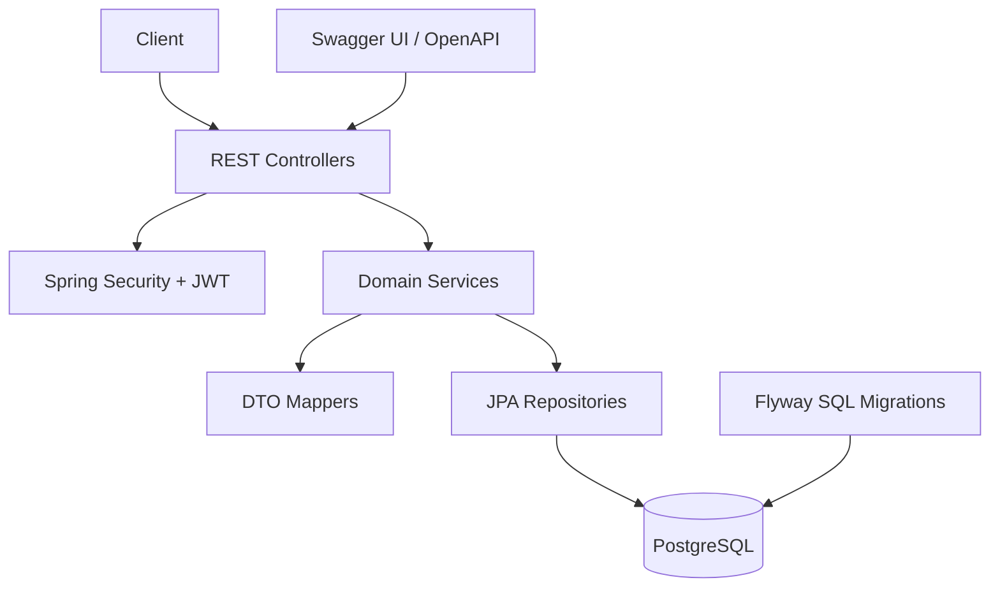

## Layered Architecture

| Layer | Packages | Responsibility |
| --- | --- | --- |
| Application/API | `com.chalchitraghar.applications.*` | HTTP routing, request validation, response wrapping |
| Domain modules | `com.chalchitraghar.modules.*` | Business behavior for auth, users, movies, halls, shows, seats, bookings |
| Persistence | `modules.*.repository` | Spring Data JPA access and custom locking queries |
| Mapping | `modules.*.mapper` | Entity-to-DTO and DTO-to-entity conversion |
| Shared infrastructure | `com.chalchitraghar.shared.*` | Security, exceptions, API response wrapper, base entity, OpenAPI config |
| Database migration | `src/main/resources/db/migration` | Versioned PostgreSQL schema migrations |

## Modular Monolith Structure

```text
com.chalchitraghar
├── applications
│   ├── auth
│   ├── publicapi
│   ├── customer
│   ├── staff
│   └── admin
├── modules
│   ├── auth
│   ├── users
│   ├── movies
│   ├── halls
│   ├── shows
│   ├── seats
│   └── bookings
└── shared
    ├── config
    ├── exception
    ├── response
    └── security
```

The `applications` package defines entry points by audience. The `modules` package contains reusable domain logic and persistence. This keeps endpoint authorization boundaries visible without splitting the backend into separate services.

## Controller to Service to Repository Flow

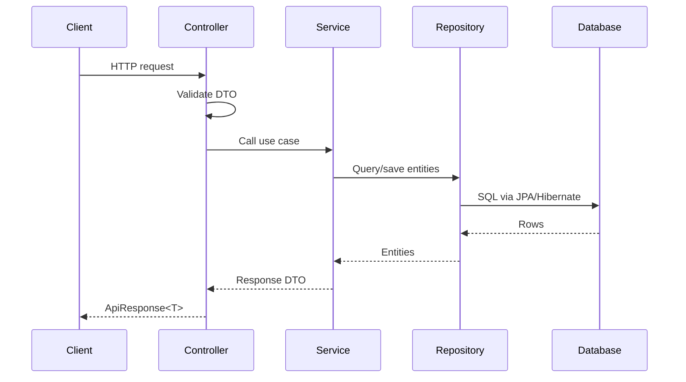

## DTO Flow

Request DTOs are validated with Jakarta Bean Validation in controller methods annotated with `@Valid`. Services receive validated DTOs and current user context where needed.

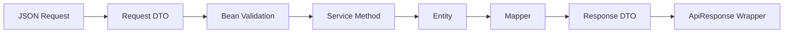

Important DTOs:

| DTO | Used by |
| --- | --- |
| `RegistrationRequest`, `LoginRequest`, `GoogleLoginRequest`, `RefreshTokenRequest`, `ForgotPasswordRequest`, `ResetPasswordRequest` | Auth |
| `MovieRequest`, `HallRequest`, `ShowRequest` | Admin management |
| `SeatHoldRequest`, `BookingRequest` | Customer booking workflow |
| `MovieResponse`, `HallResponse`, `ShowResponse`, `SeatResponse`, `BookingResponse` | API responses |
| `UserResponse` | Authenticated customer profile response |
| `AdminUserSummaryResponse`, `AdminUserDetailResponse` | Admin user lookup responses |

User responses are intentionally split by audience. Customer profile endpoints use `UserResponse`, while admin user endpoints use `AdminUserSummaryResponse` for lists and `AdminUserDetailResponse` for detail lookup. None of these DTOs expose passwords, Google subject IDs, internal hashes, or OTP data.

## Mapper Flow

Mappers are Spring components and convert between entities and DTOs:

| Mapper | Responsibility |
| --- | --- |
| `MovieMapper` | Movie request/response mapping |
| `HallMapper` | Hall request/response mapping |
| `ShowMapper` | Show mapping with nested movie and hall responses |
| `SeatMapper` | Seat entity to public seat response |
| `BookingMapper` | Booking response with selected seats and total price |
| `UserMapper` | User profile, admin user summary, and admin user detail responses |

## Authentication Flow

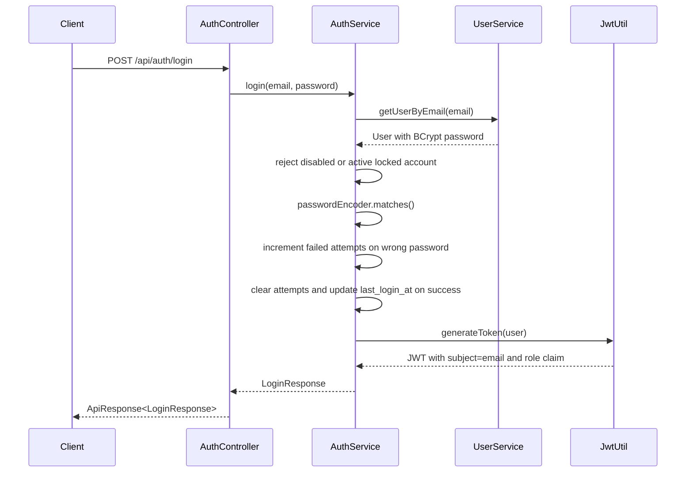

`JwtAuthenticationFilter` extracts `Authorization: Bearer <token>`, validates the token, loads the user by email, rejects disabled or locked users, rejects tokens issued before `password_changed_at`, and sets Spring Security authentication with `ROLE_<role>`.

Account lockout rules:

- Local password failures increment `failed_login_attempts`.
- 5 failed attempts set `locked=true` and `locked_until` to 15 minutes in the future.
- Active locks reject local and Google login with a clean `ApiResponse` error.
- Expired locks are cleared on the next successful login.
- Successful local or Google login resets failed attempts and updates `last_login_at`.
- Google token verification failures do not increment local password failure counters.
- `enabled=false` prevents local login, Google login, and protected endpoint access with existing tokens.
- Registration, password change, and OTP password reset update `password_changed_at`; old JWTs are rejected after that timestamp.

## Google Authentication Flow

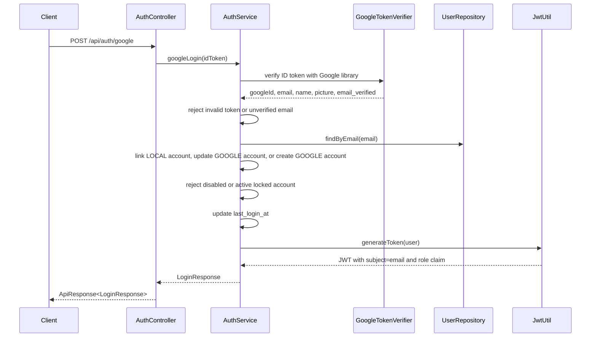

Google authentication keeps the existing JWT format unchanged: subject is the user email and the `role` claim is the role name. Existing local accounts are linked only when Google reports a verified email, and the local BCrypt password is preserved. Google-only accounts store no password and password login returns `This account uses Google Sign-In.`.

## Password Reset Flow

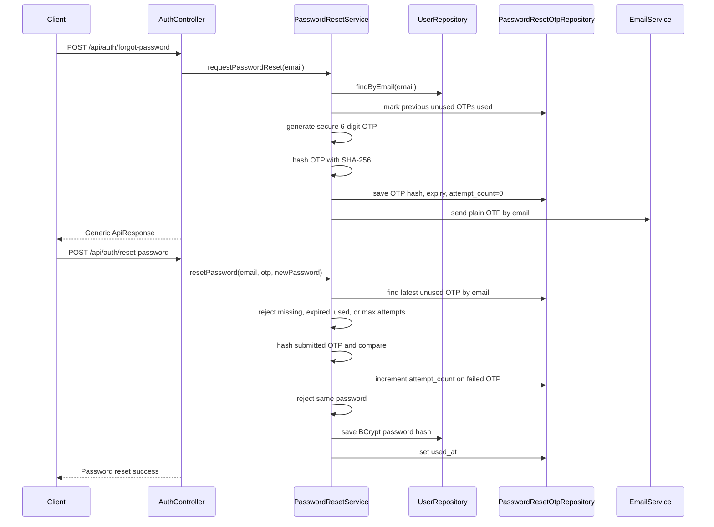

Password reset OTPs are one-time-use and expire after 10 minutes by default. The database stores only `otp_hash`; plain OTPs exist only in the email message and incoming reset request. Only the latest unused OTP for a user is accepted, and failed OTP verification increments `attempt_count` up to the configured maximum. Forgot-password responses are intentionally generic so callers cannot enumerate accounts by email.

## Authorization Flow

Authorization is centralized in `SecurityConfig`.

| Matcher | Access |
| --- | --- |
| `/swagger-ui.html`, `/swagger-ui/**`, `/v3/api-docs/**` | Public |
| `/api/auth/**` | Public |
| `/api/public/**` | Public |
| `/api/customer/**` | CUSTOMER, STAFF, ADMIN |
| `/api/staff/**` | STAFF, ADMIN |
| `/api/admin/**` | ADMIN |
| Other requests | Authenticated |

Controllers do not use `@PreAuthorize`; route-level access is controlled by request matchers.

## Booking Flow

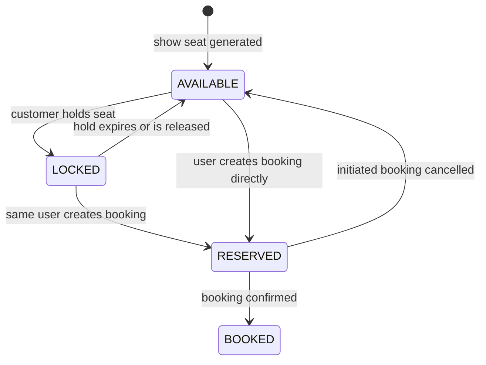

Booking entity statuses used by the code:

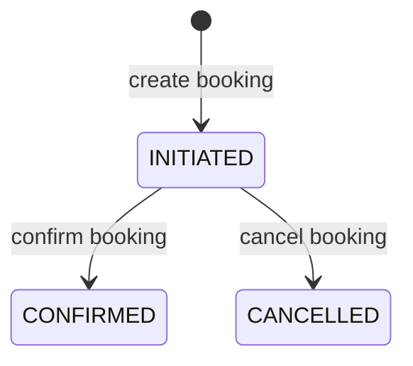

`BookingStatus` also defines `PENDING`, `BOOKED`, and `EXPIRED`, but the current service workflow creates `INITIATED`, confirms to `CONFIRMED`, and cancels to `CANCELLED`.

## Seat Hold Flow

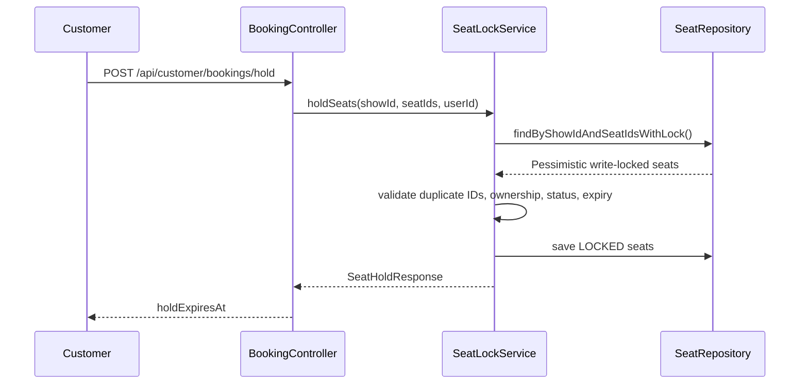

Seat holds last 10 minutes. `ExpiredSeatLockCleanupJob` runs every 60 seconds and releases expired `LOCKED` seats.

## Flyway Startup

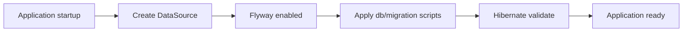

The main profile uses PostgreSQL with `spring.jpa.hibernate.ddl-auto=validate`. Schema changes are expected to be made through Flyway migrations.

## Docker Architecture

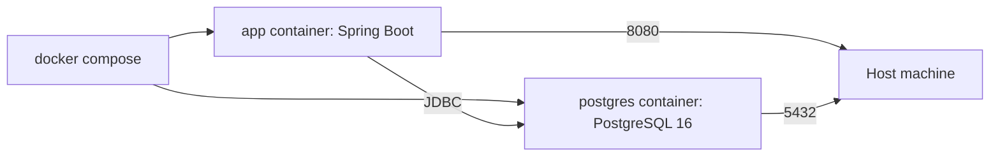

The Dockerfile builds the application with Maven in a JDK image, then runs the packaged jar in a smaller JRE image.

## Request Lifecycle

1. Client sends HTTP request.
2. CORS and Spring Security filters run.
3. JWT filter validates bearer token if present.
4. Security matchers authorize the route.
5. Controller binds path/query/body parameters.
6. Bean Validation validates request DTOs.
7. Service executes the business use case in a transaction when needed.
8. Repository reads or writes entities.
9. Mapper returns DTOs.
10. Controller wraps response in `ApiResponse<T>`.
11. `GlobalExceptionHandler` converts exceptions into standard error responses.
