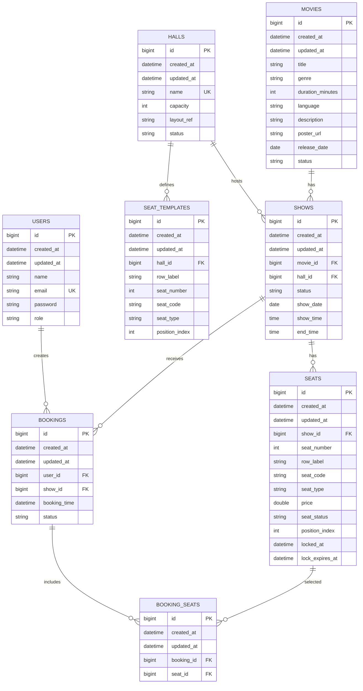

# Database Documentation

## Database Engine

The application uses MySQL through Spring Data JPA and Hibernate.

Configured database:

```yaml
url: jdbc:mysql://localhost:3306/hamro_chalachitraghar_db
username: root
password: "@@Himal@@"
```

Schema management is configured as:

```yaml
spring.jpa.hibernate.ddl-auto: update
```

No explicit migration tool or migration files were found.

## Entity Relationship Overview



## Tables, Models, And Constraints

### `users`

Model: `User`

Important fields:

- `name`: not blank.
- `email`: not blank, email format, unique column.
- `password`: not blank, min 8 characters, stored hashed by registration service.
- `role`: enum `CUSTOMER`, `STAFF`, `ADMIN`.

### `movies`

Model: `Movie`

Important fields:

- `title`, `genre`, `language`, `description`, `posterUrl`: not blank.
- `durationMinutes`: not null, positive or zero.
- `releaseDate`: not null.
- `status`: enum `UPCOMING`, `NOW_SHOWING`, `ENDED`.

No unique constraint is implemented for title/release date despite a repository lookup method existing.

### `halls`

Model: `Hall`

Important fields:

- `name`: not blank, unique column.
- `capacity`: positive or zero.
- `layoutRef`: not blank.
- `status`: enum `ACTIVE`, `INACTIVE`; defaults to `ACTIVE` on persist.

Indexes:

- `idx_hall_name`
- `idx_hall_status`

### `seat_templates`

Model: `SeatTemplate`

Important fields:

- `hall_id`: required many-to-one.
- `rowLabel`, `seatNumber`, `seatCode`, `seatType`, `positionIndex`.
- `seatCode` is regenerated from `rowLabel + seatNumber` on persist/update.

Generated layout:

- Row A, seats 1-8, type `PREMIUM`.
- Rows B-J, seats 1-20, type `PLATINUM`.
- Total generated templates per hall: 188.

### `shows`

Model: `Show`

Important fields:

- `movie_id`: required many-to-one.
- `hall_id`: required many-to-one.
- `status`: enum `SCHEDULED`, `RUNNING`, `COMPLETED`, `CANCELLED`; defaults to `SCHEDULED`.
- `showDate`, `showTime`, `endTime`: required.

Show creation rules:

- Movie must be `NOW_SHOWING`.
- Hall must not be `INACTIVE`.
- Hall/date/time must not overlap a non-cancelled show.
- Seats are generated after show creation.

### `seats`

Model: `Seat`

Important fields:

- `show_id`: required many-to-one.
- `seatNumber`, `rowLabel`, `seatCode`, `seatType`, `price`, `seatStatus`, `positionIndex`.
- `lockedAt`, `lockExpiresAt`: nullable lock timestamps.
- `seatStatus`: enum `AVAILABLE`, `LOCKED`, `BOOKED`, `RESERVED`, `CANCELLED`; defaults to `AVAILABLE`.

Price rules:

- `PREMIUM`: 750.0
- `PLATINUM`: 500.0

### `bookings`

Model: `Booking`

Important fields:

- `user_id`: required many-to-one.
- `show_id`: required many-to-one.
- `bookingTime`: defaults to current time.
- `status`: enum `INITIATED`, `PENDING`, `CONFIRMED`, `BOOKED`, `CANCELLED`, `EXPIRED`; defaults to `INITIATED`.

### `booking_seats`

Model: `BookingSeat`

Join table entity between bookings and seats.

Important fields:

- `booking_id`: required.
- `seat_id`: required.

No explicit unique constraint was found to prevent the same seat appearing in multiple booking records. The service checks this in code.

## Migrations

No Flyway, Liquibase, SQL migration directory, or schema migration files were found.

Current behavior: Hibernate updates the schema automatically at application startup.

## Seed Data

No seed data scripts or application startup seeders were found.

Unknown / needs confirmation:

- How admin users are created.
- Whether development data is manually inserted.
- Whether production seed data exists outside this repository.

## Important Constraints And Risks

- `users.email` is unique.
- `halls.name` is unique.
- Many fields are non-null through JPA column settings and validation annotations.
- Database schema changes are not versioned.
- Some uniqueness and lifecycle rules are enforced only in services, not by database constraints.
- Expired lock cleanup is not scheduled.
