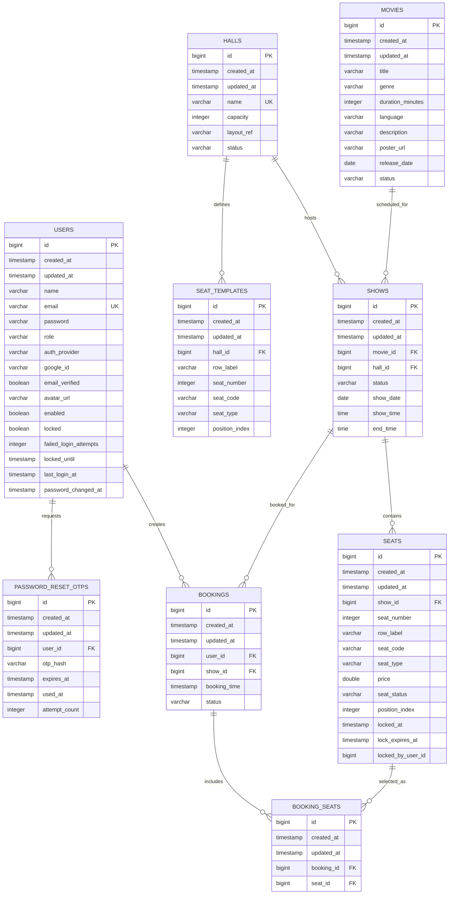

# Database

Hamro Chitralekha Backend uses PostgreSQL in development and production. The schema is managed by Flyway SQL migrations in `src/main/resources/db/migration`.

Hibernate is configured with `ddl-auto: validate`, so the application validates the schema at startup instead of generating it.

## Database Overview

| Item                 | Implementation                             |
|----------------------|--------------------------------------------|
| Database engine      | PostgreSQL                                 |
| Local Docker version | PostgreSQL 16                              |
| ORM                  | Spring Data JPA / Hibernate                |
| Migration tool       | Flyway                                     |
| Migration location   | `classpath:db/migration`                   |
| Primary key strategy | `BIGSERIAL` database identity columns      |
| Shared audit fields  | `created_at`, `updated_at` on all entities |

## ER Diagram

## Tables

### `users`

Stores authentication and authorization accounts.

| Column           | Type           | Nullable | Constraints                                      | Entity field     |
|------------------|----------------|----------|--------------------------------------------------|------------------|
| `id`             | `BIGSERIAL`    | No       | Primary key                                      | `id`             |
| `created_at`     | `TIMESTAMP`    | No       | Set by `GenericEntity`                           | `createdAt`      |
| `updated_at`     | `TIMESTAMP`    | No       | Set by `GenericEntity`                           | `updatedAt`      |
| `name`           | `VARCHAR(255)` | No       | Not blank validation                             | `name`           |
| `email`          | `VARCHAR(255)` | No       | Unique `uk_users_email`, email validation        | `email`          |
| `password`       | `VARCHAR(255)` | Yes      | BCrypt hash for local accounts; null for Google-only accounts | `password`       |
| `role`           | `VARCHAR(255)` | No       | Enum string: `CUSTOMER`, `STAFF`, `ADMIN`        | `role`           |
| `auth_provider`  | `VARCHAR(20)`  | No       | Enum string: `LOCAL`, `GOOGLE`; default `LOCAL`  | `authProvider`   |
| `google_id`      | `VARCHAR(255)` | Yes      | Google account subject identifier                | `googleId`       |
| `email_verified` | `BOOLEAN`      | No       | Default `false`; true for verified Google email  | `emailVerified`  |
| `avatar_url`     | `VARCHAR(500)` | Yes      | Google profile picture URL                       | `avatarUrl`      |
| `enabled`        | `BOOLEAN`      | No       | Default `true`; disabled accounts cannot authenticate | `enabled`        |
| `locked`         | `BOOLEAN`      | No       | Default `false`; true during account lockout     | `locked`         |
| `failed_login_attempts` | `INTEGER` | No      | Default `0`; wrong local password counter        | `failedLoginAttempts` |
| `locked_until`   | `TIMESTAMP`    | Yes      | End of temporary lockout window                  | `lockedUntil`    |
| `last_login_at`  | `TIMESTAMP`    | Yes      | Updated after successful local or Google login   | `lastLoginAt`    |
| `password_changed_at` | `TIMESTAMP` | Yes     | Updated after registration, profile password change, and OTP reset | `passwordChangedAt` |

Authentication provider rules:

- `LOCAL` users authenticate with BCrypt password login and may also be linked to Google by verified email.
- Admin-created internal users are always `LOCAL` and receive a BCrypt password hash at creation time.
- `GOOGLE` users authenticate with Google ID tokens; their password is nullable and password login is rejected with a clean authentication error.
- Account linking stores Google metadata without overwriting an existing local password.
- Local password failures increment `failed_login_attempts`; 5 failures lock the account for 15 minutes.
- Successful local or Google login clears lock state and updates `last_login_at`.
- `password_changed_at` is used to reject JWTs issued before the latest password change.
- Administrative role changes update only `role`; password, provider, Google metadata, login counters, lock expiry, last login, and password change timestamp are not lifecycle-update fields.
- The application protects the last enabled `ADMIN` in service logic before disabling, locking, or changing that account to another role.

### `password_reset_otps`

Stores one-time password reset OTP records. Plain OTP values are never stored; only an SHA-256 hash of the email OTP is persisted.

| Column          | Type           | Nullable | Constraints            | Entity field   |
|-----------------|----------------|----------|------------------------|----------------|
| `id`            | `BIGSERIAL`    | No       | Primary key            | `id`           |
| `created_at`    | `TIMESTAMP`    | No       | Set by `GenericEntity` | `createdAt`    |
| `updated_at`    | `TIMESTAMP`    | No       | Set by `GenericEntity` | `updatedAt`    |
| `user_id`       | `BIGINT`       | No       | FK to `users.id`       | `user`         |
| `otp_hash`      | `VARCHAR(255)` | No       | SHA-256 hash of OTP    | `otpHash`      |
| `expires_at`    | `TIMESTAMP`    | No       | 10-minute OTP expiry   | `expiresAt`    |
| `used_at`       | `TIMESTAMP`    | Yes      | Set when OTP is used   | `usedAt`       |
| `attempt_count` | `INTEGER`      | No       | Defaults to `0`        | `attemptCount` |

OTP lifecycle:

- Forgot password creates a secure random 6-digit numeric OTP, sends the plain OTP by email, and stores only `otp_hash`.
- Creating a new OTP marks previous unused OTPs for the same user as used.
- Reset password hashes the submitted OTP and compares it to the latest unused OTP for the email.
- OTPs are rejected when missing, expired, already used, not latest, or above the configured attempt limit.
- Failed OTP verification increments `attempt_count`; the current limit is configurable through `PASSWORD_RESET_MAX_ATTEMPTS`.
- Successful reset updates the BCrypt password hash and sets `used_at`.

### `movies`

Stores movie catalog metadata.

| Column             | Type           | Nullable | Constraints                                     | Entity field      |
|--------------------|----------------|----------|-------------------------------------------------|-------------------|
| `id`               | `BIGSERIAL`    | No       | Primary key                                     | `id`              |
| `created_at`       | `TIMESTAMP`    | No       | Audit field                                     | `createdAt`       |
| `updated_at`       | `TIMESTAMP`    | No       | Audit field                                     | `updatedAt`       |
| `title`            | `VARCHAR(255)` | No       | Not blank validation                            | `title`           |
| `title_normalized` | `VARCHAR(255)` | No       | Unique with `release_date` for duplicate guard  | `titleNormalized` |
| `genre`            | `VARCHAR(255)` | No       | Not blank validation                            | `genre`           |
| `duration_minutes` | `INTEGER`      | No       | Must be between 1 and 600                       | `durationMinutes` |
| `language`         | `VARCHAR(255)` | No       | Not blank validation                            | `language`        |
| `description`      | `VARCHAR(255)` | No       | Not blank validation                            | `description`     |
| `poster_url`       | `VARCHAR(500)` | No       | Valid `http`/`https` URL                        | `posterUrl`       |
| `release_date`     | `DATE`         | No       | Not null validation                             | `releaseDate`     |
| `status`           | `VARCHAR(255)` | No       | Enum string: `UPCOMING`, `NOW_SHOWING`, `ENDED` | `status`          |

`title_normalized` stores `lower(trim(title))`. The unique index `uk_movies_title_normalized_release_date` enforces case-insensitive duplicate prevention for a movie title on the same release date.

Movies are soft-deleted by changing `status` to `ENDED`; rows are not physically removed and there is no `deleted_at` column. Public movie APIs hide `ENDED` movies, while admin APIs can still query them. Because `shows.movie_id` references `movies.id`, ending a movie is blocked in service code when future active shows exist.

### `halls`

Stores cinema halls.

| Column       | Type           | Nullable | Constraints                                                     | Entity field |
|--------------|----------------|----------|-----------------------------------------------------------------|--------------|
| `id`         | `BIGSERIAL`    | No       | Primary key                                                     | `id`         |
| `created_at` | `TIMESTAMP`    | No       | Audit field                                                     | `createdAt`  |
| `updated_at` | `TIMESTAMP`    | No       | Audit field                                                     | `updatedAt`  |
| `name`       | `VARCHAR(255)` | No       | Unique `uk_halls_name`; normalized unique index `uk_halls_name_normalized`; indexed by `idx_hall_name` | `name`       |
| `capacity`   | `INTEGER`      | No       | Service/API validation: `1` to `1000`                           | `capacity`   |
| `layout_ref` | `VARCHAR(255)` | No       | Required; max `100`; letters, numbers, hyphen, underscore       | `layoutRef`  |
| `status`     | `VARCHAR(255)` | No       | Enum string: `ACTIVE`, `INACTIVE`; indexed by `idx_hall_status` | `status`     |

Hall rows are not physically deleted. Admin delete marks the hall `INACTIVE`; public hall APIs hide inactive halls. Inactivation is blocked in service code when future active shows reference the hall. Once seat templates exist for a hall, `capacity` and `layout_ref` are treated as immutable because generated show seats depend on the original template.

### `seat_templates`

Stores reusable hall seat layouts. A show uses these templates to generate concrete `seats`.

| Column           | Type           | Nullable | Constraints                              | Entity field    |
|------------------|----------------|----------|------------------------------------------|-----------------|
| `id`             | `BIGSERIAL`    | No       | Primary key                              | `id`            |
| `created_at`     | `TIMESTAMP`    | No       | Audit field                              | `createdAt`     |
| `updated_at`     | `TIMESTAMP`    | No       | Audit field                              | `updatedAt`     |
| `hall_id`        | `BIGINT`       | No       | FK to `halls.id`                         | `hall`          |
| `row_label`      | `VARCHAR(255)` | No       | Not blank validation                     | `rowLabel`      |
| `seat_number`    | `INTEGER`      | No       | Positive validation                      | `seatNumber`    |
| `seat_code`      | `VARCHAR(255)` | No       | Generated from row label and seat number | `seatCode`      |
| `seat_type`      | `VARCHAR(255)` | No       | Enum string: `PREMIUM`, `PLATINUM`       | `seatType`      |
| `position_index` | `INTEGER`      | No       | Used for display ordering                | `positionIndex` |

The current seat layout generator creates 188 templates per hall:

| Rows          | Count | Type       |
|---------------|-------|------------|
| `A1` to `A8`  | 8     | `PREMIUM`  |
| `B1` to `J20` | 180   | `PLATINUM` |

Seat template generation currently requires the hall to be `ACTIVE`, to have no existing templates, and to have `capacity = 188`.

Template integrity is also protected by unique constraints on `(hall_id, seat_code)`, `(hall_id, row_label, seat_number)`, and `(hall_id, position_index)`. Concrete show seats have corresponding unique constraints on `(show_id, seat_code)`, `(show_id, row_label, seat_number)`, and `(show_id, position_index)`. These constraints prevent duplicate inventory during concurrent or accidental writes.

### `shows`

Stores scheduled screenings.

| Column       | Type           | Nullable | Constraints                                                   | Entity field |
|--------------|----------------|----------|---------------------------------------------------------------|--------------|
| `id`         | `BIGSERIAL`    | No       | Primary key                                                   | `id`         |
| `created_at` | `TIMESTAMP`    | No       | Audit field                                                   | `createdAt`  |
| `updated_at` | `TIMESTAMP`    | No       | Audit field                                                   | `updatedAt`  |
| `movie_id`   | `BIGINT`       | No       | FK to `movies.id`                                             | `movie`      |
| `hall_id`    | `BIGINT`       | No       | FK to `halls.id`                                              | `hall`       |
| `status`     | `VARCHAR(255)` | No       | Enum string: `SCHEDULED`, `RUNNING`, `COMPLETED`, `CANCELLED` | `status`     |
| `show_date`  | `DATE`         | No       | Must be a future date in request DTO                          | `showDate`   |
| `show_time`  | `TIME`         | No       | Start time                                                    | `showTime`   |
| `end_time`   | `TIME`         | No       | End time                                                      | `endTime`    |

The service prevents overlapping non-cancelled shows in the same hall on the same date and reserves a configurable cleaning buffer (15 minutes by default) on both sides of a candidate interval. Scheduling validation also rejects past starts, non-positive/overnight intervals, and end times outside the configured five-minute tolerance from the movie duration. These remain service-level rules; there is no database exclusion constraint or concurrency-locking redesign.

### `seats`

Stores concrete seats for a specific show.

| Column              | Type               | Nullable | Constraints                                                           | Entity field     |
|---------------------|--------------------|----------|-----------------------------------------------------------------------|------------------|
| `id`                | `BIGSERIAL`        | No       | Primary key                                                           | `id`             |
| `created_at`        | `TIMESTAMP`        | No       | Audit field                                                           | `createdAt`      |
| `updated_at`        | `TIMESTAMP`        | No       | Audit field                                                           | `updatedAt`      |
| `show_id`           | `BIGINT`           | No       | FK to `shows.id`                                                      | `show`           |
| `seat_number`       | `INTEGER`          | No       | Not null validation                                                   | `seatNumber`     |
| `row_label`         | `VARCHAR(255)`     | No       | Not null validation                                                   | `rowLabel`       |
| `seat_code`         | `VARCHAR(255)`     | No       | Not null validation                                                   | `seatCode`       |
| `seat_type`         | `VARCHAR(255)`     | No       | Enum string: `PREMIUM`, `PLATINUM`                                    | `seatType`       |
| `price`             | `DOUBLE PRECISION` | No       | Positive validation                                                   | `price`          |
| `seat_status`       | `VARCHAR(255)`     | No       | Enum string: `AVAILABLE`, `LOCKED`, `BOOKED`, `RESERVED`, `CANCELLED` | `seatStatus`     |
| `position_index`    | `INTEGER`          | No       | Used for display ordering                                             | `positionIndex`  |
| `locked_at`         | `TIMESTAMP`        | Yes      | Set when held                                                         | `lockedAt`       |
| `lock_expires_at`   | `TIMESTAMP`        | Yes      | Set to 10 minutes after hold                                          | `lockExpiresAt`  |
| `locked_by_user_id` | `BIGINT`           | Yes      | User ID that owns active lock                                         | `lockedByUserId` |

Current generated prices:

| Seat type  | Price   |
|------------|---------|
| `PREMIUM`  | `750.0` |
| `PLATINUM` | `500.0` |

This category pricing is owned by the shared `SeatPricingPolicy` used during show-seat generation.

Concrete show seats are immutable snapshots of the hall templates at show creation time. Cancelling a show retains these records for history; show status controls public availability. `SeatStatus.CANCELLED` remains defined but is currently unused.

### `bookings`

Stores a booking record for one user and one show.

| Column         | Type           | Nullable | Constraints                                                                        | Entity field  |
|----------------|----------------|----------|------------------------------------------------------------------------------------|---------------|
| `id`           | `BIGSERIAL`    | No       | Primary key                                                                        | `id`          |
| `created_at`   | `TIMESTAMP`    | No       | Audit field                                                                        | `createdAt`   |
| `updated_at`   | `TIMESTAMP`    | No       | Audit field                                                                        | `updatedAt`   |
| `user_id`      | `BIGINT`       | No       | FK to `users.id`                                                                   | `user`        |
| `show_id`      | `BIGINT`       | No       | FK to `shows.id`                                                                   | `show`        |
| `booking_time` | `TIMESTAMP`    | No       | Defaults at persist time if not set                                                | `bookingTime` |
| `status`       | `VARCHAR(255)` | No       | Enum string: `INITIATED`, `PENDING`, `CONFIRMED`, `BOOKED`, `CANCELLED`, `EXPIRED` | `status`      |

The current service flow uses `INITIATED`, `CONFIRMED`, and `CANCELLED`.

### `booking_seats`

Join table between bookings and selected seats.

| Column       | Type        | Nullable | Constraints         | Entity field |
|--------------|-------------|----------|---------------------|--------------|
| `id`         | `BIGSERIAL` | No       | Primary key         | `id`         |
| `created_at` | `TIMESTAMP` | No       | Audit field         | `createdAt`  |
| `updated_at` | `TIMESTAMP` | No       | Audit field         | `updatedAt`  |
| `booking_id` | `BIGINT`    | No       | FK to `bookings.id` | `booking`    |
| `seat_id`    | `BIGINT`    | No       | FK to `seats.id`    | `seat`       |

## Constraints

| Name                                  | Table                   | Definition                             |
|---------------------------------------|-------------------------|----------------------------------------|
| `uk_users_email`                      | `users`                 | Unique email                           |
| `uk_movies_title_normalized_release_date` | `movies`            | Unique normalized title and release date |
| `uk_halls_name`                       | `halls`                 | Unique hall name                       |
| `uk_halls_name_normalized`            | `halls`                 | Unique `lower(trim(name))` hall name   |
| `fk_password_reset_otps_user`         | `password_reset_otps`   | `user_id` references `users(id)`       |
| `fk_seat_templates_hall`              | `seat_templates`        | `hall_id` references `halls(id)`       |
| `fk_shows_movie`                      | `shows`                 | `movie_id` references `movies(id)`     |
| `fk_shows_hall`                       | `shows`                 | `hall_id` references `halls(id)`       |
| `fk_seats_show`                       | `seats`                 | `show_id` references `shows(id)`       |
| `fk_bookings_user`                    | `bookings`              | `user_id` references `users(id)`       |
| `fk_bookings_show`                    | `bookings`              | `show_id` references `shows(id)`       |
| `fk_booking_seats_booking`            | `booking_seats`         | `booking_id` references `bookings(id)` |
| `fk_booking_seats_seat`               | `booking_seats`         | `seat_id` references `seats(id)`       |

## Indexes

| Index                                      | Table    | Columns                            |
|--------------------------------------------|----------|------------------------------------|
| `uk_movies_title_normalized_release_date`  | `movies` | `title_normalized`, `release_date` |
| `idx_hall_name`                            | `halls`  | `name`                             |
| `idx_hall_status`                          | `halls`  | `status`                           |

## Relationships

| Relationship           | Type                                 |
|------------------------|--------------------------------------|
| User to bookings       | One user has many bookings           |
| Movie to shows         | One movie has many shows             |
| Hall to shows          | One hall has many shows              |
| Hall to seat templates | One hall has many seat templates     |
| Show to seats          | One show has many generated seats    |
| Show to bookings       | One show has many bookings           |
| Booking to seats       | Many-to-many through `booking_seats` |

## Booking Lifecycle

1. A show is created by admin.
2. Seats are generated from the hall's seat templates.
3. A customer may hold available seats, changing `seats.seat_status` to `LOCKED`.
4. The same customer can create a booking from held or directly available seats.
5. Booking creation sets booking status to `INITIATED`, creates `booking_seats`, and marks seats `RESERVED`.
6. Confirmation sets booking status to `CONFIRMED` and seats to `BOOKED`.
7. Cancellation is allowed only for `INITIATED` bookings before show time and returns seats to `AVAILABLE`.

## Seat Hold Columns

| Column              | Purpose                                                                              |
|---------------------|--------------------------------------------------------------------------------------|
| `seat_status`       | Stores `LOCKED` while a hold is active                                               |
| `locked_at`         | Records when the hold was created or refreshed                                       |
| `lock_expires_at`   | Records when the 10-minute hold expires                                              |
| `locked_by_user_id` | Allows the owning user to convert the hold into a booking while blocking other users |

Seat locking queries use `PESSIMISTIC_WRITE` to prevent concurrent booking updates from claiming the same seat at the same time.

## Flyway Migration Strategy

| Order | Purpose                                         |
|-------|-------------------------------------------------|
| 1     | Creates users                                   |
| 2     | Creates movies                                  |
| 3     | Creates halls and hall indexes                  |
| 4     | Creates reusable hall seat templates            |
| 5     | Creates shows                                   |
| 6     | Creates concrete show seats and hold timestamps |
| 7     | Creates bookings                                |
| 8     | Creates booking-seat join table                 |
| 9     | Adds `locked_by_user_id` to seats               |
| 10    | Creates password reset OTPs                     |
| 11    | Adds Google auth fields to users                |
| 12    | Adds account security fields to users           |
| 13    | Adds movie normalized title uniqueness and expands poster URL length |
| 14    | Adds normalized hall name uniqueness            |

Migration rules:

- Add schema changes as new `V<number>__description.sql` files.
- Do not edit migrations that have already been applied to a shared database.
- Keep entity mappings, DTOs, repositories, and documentation in sync with migrations.
- Run tests after adding migrations.
