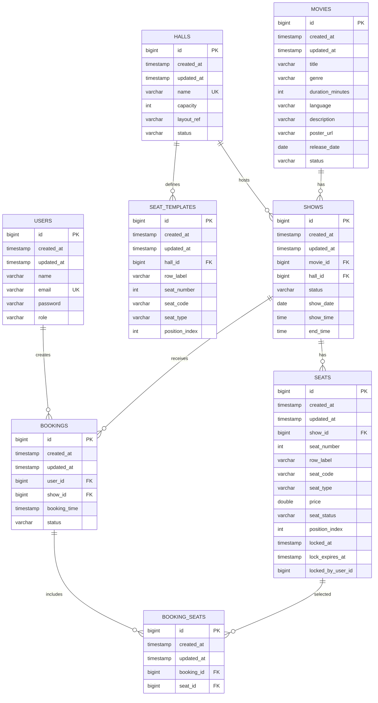

# Database Documentation

## Database Engine

The V2 backend uses PostgreSQL through Spring Data JPA and Hibernate.

Schema management:

- Flyway owns schema creation and migration.
- Hibernate is configured with `ddl-auto: validate`, not `update`.
- Application startup fails if entities and the database schema do not match.

Migration files live under:

```text
src/main/resources/db/migration
```

Current migrations:

```text
V1__create_users_table.sql
V2__create_movies_table.sql
V3__create_halls_table.sql
V4__create_seat_templates_table.sql
V5__create_shows_table.sql
V6__create_seats_table.sql
V7__create_bookings_table.sql
V8__create_booking_seats_table.sql
V9__add_seat_lock_owner.sql
```

## Configuration

Base configuration in `application.yaml`:

```yaml
spring:
  datasource:
    driver-class-name: org.postgresql.Driver
  jpa:
    database-platform: org.hibernate.dialect.PostgreSQLDialect
    hibernate:
      ddl-auto: validate
  flyway:
    enabled: true
    locations: classpath:db/migration
```

Development database values come from environment variables with defaults in `application-dev.yaml`.

Production database values are required from environment variables in `application-prod.yaml`.

## Entity Relationship Overview



## Tables

### `users`

Purpose: application users and authentication data.

Important columns:

- `email`: unique.
- `password`: BCrypt hash.
- `role`: `CUSTOMER`, `STAFF`, or `ADMIN`.

Constraints:

- Primary key: `id`
- Unique: `uk_users_email`

### `movies`

Purpose: movie catalog.

Important columns:

- `status`: `UPCOMING`, `NOW_SHOWING`, or `ENDED`.
- `release_date`: required.

Notes:

- Delete operations soft-delete by setting movie status to `ENDED`.
- The database does not currently enforce unique title/release date.

### `halls`

Purpose: cinema hall metadata.

Important columns:

- `name`: unique.
- `capacity`: required.
- `layout_ref`: required.
- `status`: `ACTIVE` or `INACTIVE`.

Constraints and indexes:

- Unique: `uk_halls_name`
- Index: `idx_hall_name`
- Index: `idx_hall_status`

Notes:

- Delete operations soft-delete by setting hall status to `INACTIVE`.

### `seat_templates`

Purpose: reusable hall-level seat layout.

Important columns:

- `hall_id`: foreign key to `halls.id`.
- `row_label`, `seat_number`, `seat_code`, `seat_type`, `position_index`.

Foreign keys:

- `fk_seat_templates_hall`

Generated layout:

- Row A, seats 1-8, type `PREMIUM`.
- Rows B-J, seats 1-20, type `PLATINUM`.
- Total generated templates per hall: 188.

### `shows`

Purpose: scheduled movie screenings.

Important columns:

- `movie_id`: foreign key to `movies.id`.
- `hall_id`: foreign key to `halls.id`.
- `status`: `SCHEDULED`, `RUNNING`, `COMPLETED`, or `CANCELLED`.
- `show_date`, `show_time`, `end_time`: required.

Foreign keys:

- `fk_shows_movie`
- `fk_shows_hall`

Service rules:

- Movie must be `NOW_SHOWING`.
- Hall must not be `INACTIVE`.
- Show time must not overlap another non-cancelled show in the same hall on the same date.
- Seats are generated after show creation from `seat_templates`.

### `seats`

Purpose: show-specific seats and booking state.

Important columns:

- `show_id`: foreign key to `shows.id`.
- `seat_status`: `AVAILABLE`, `LOCKED`, `RESERVED`, `BOOKED`, or `CANCELLED`.
- `locked_at`: timestamp when a hold started.
- `lock_expires_at`: timestamp when a hold expires.
- `locked_by_user_id`: ID of the user that owns the active hold.

Foreign keys:

- `fk_seats_show`

Seat prices:

- `PREMIUM`: 750.0
- `PLATINUM`: 500.0

### `bookings`

Purpose: booking records.

Important columns:

- `user_id`: foreign key to `users.id`.
- `show_id`: foreign key to `shows.id`.
- `booking_time`: created booking time.
- `status`: `INITIATED`, `PENDING`, `CONFIRMED`, `BOOKED`, `CANCELLED`, or `EXPIRED`.

Foreign keys:

- `fk_bookings_user`
- `fk_bookings_show`

Current flow:

- Create booking sets status to `INITIATED`.
- Confirm booking sets status to `CONFIRMED` and seats to `BOOKED`.
- Cancel an initiated booking sets status to `CANCELLED` and seats to `AVAILABLE`.

### `booking_seats`

Purpose: join entity between bookings and seats.

Important columns:

- `booking_id`: foreign key to `bookings.id`.
- `seat_id`: foreign key to `seats.id`.

Foreign keys:

- `fk_booking_seats_booking`
- `fk_booking_seats_seat`

Notes:

- The database does not currently enforce a unique seat booking constraint.
- Active duplicate bookings are prevented in service logic.

## Adding A Migration

1. Create a new SQL file under `src/main/resources/db/migration`.
2. Use the next version number:

```text
V10__short_description.sql
```

3. Make the SQL PostgreSQL-compatible.
4. Run:

```powershell
.\mvnw.cmd clean compile
.\mvnw.cmd test
```

5. Start the app and confirm Flyway applies the migration.

Do not edit an already-applied migration in a shared environment. Add a new migration instead.

## Test Database

Integration tests use the `test` profile:

- H2 in PostgreSQL compatibility mode.
- Flyway disabled.
- Hibernate `ddl-auto: create-drop`.

This keeps tests independent from a local PostgreSQL instance while still using JPA mappings and repository behavior.
