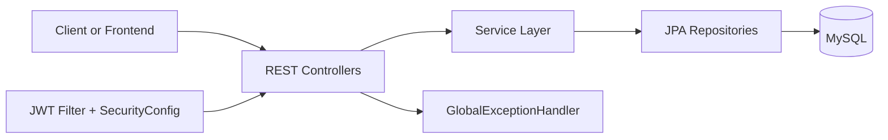
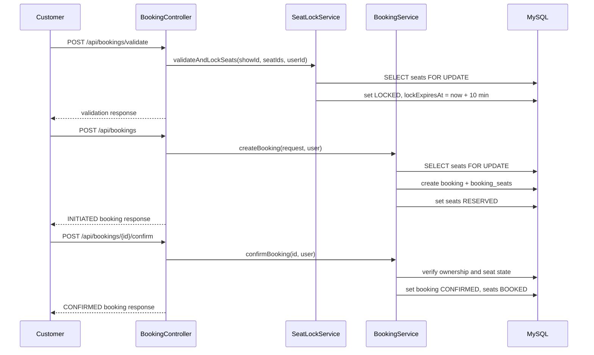
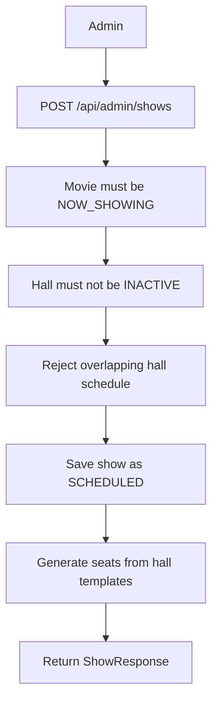
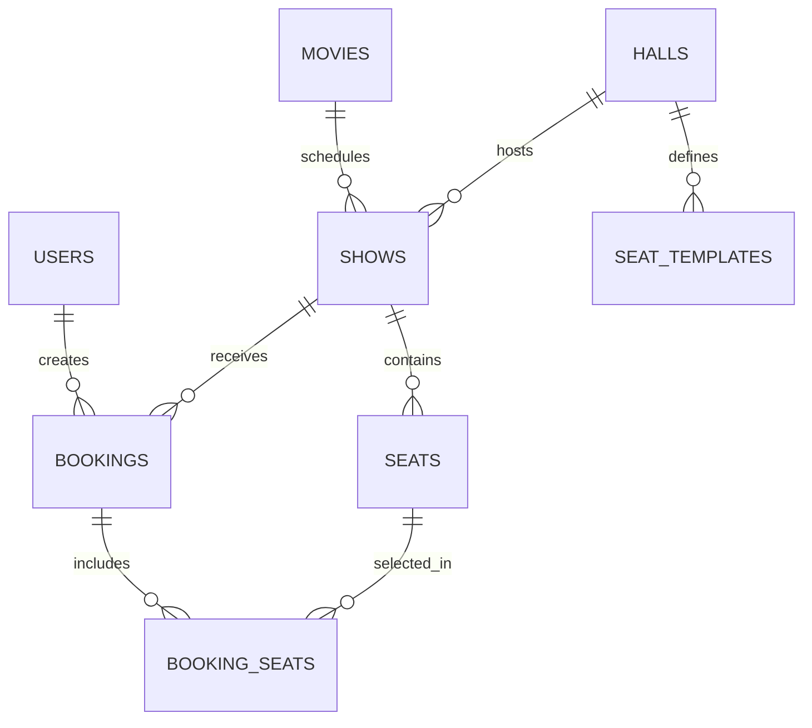

# Technical Requirements Document

## Technical Overview

This is a Java 21 Spring Boot 3.5.9 REST API for cinema catalog, schedule, seat, and booking operations. Persistence uses Spring Data JPA with MySQL. Security is stateless and based on JWT bearer tokens.

The implemented architecture is layered:

## Tech Stack

- Java 21
- Spring Boot 3.5.9
- Spring Web
- Spring Security
- Spring Data JPA
- Spring Validation
- MySQL Connector/J
- JJWT 0.11.5
- Lombok
- Maven wrapper with Maven 3.9.12 distribution
- JUnit/Spring Boot Test

## System Architecture

- `controller`: HTTP endpoint definitions.
- `service`: business rules and transaction boundaries.
- `repository`: Spring Data JPA database access.
- `model`: JPA entities and enums.
- `dto`: request and response payloads.
- `mapper`: manual entity-to-DTO conversion.
- `security`: JWT generation and request authentication filter.
- `config`: CORS, stateless security, password encoder.
- `exception`: custom exceptions and global error handler.

## Main Modules And Responsibilities

| Module | Responsibility |
| --- | --- |
| Auth | Register users, authenticate credentials, refresh JWT tokens. |
| User Admin | Read users for admins; create customer users during registration. |
| Movie | Manage and read movie metadata and release status. |
| Hall | Manage halls and active/inactive state. |
| Seat Layout | Generate reusable hall seat templates. |
| Show | Schedule shows and generate show-specific seats. |
| Seat | Read show seat availability. |
| Booking | Validate seats, lock seats, create bookings, confirm bookings, cancel bookings, read bookings. |
| Security | Enforce public/admin/authenticated route access and populate current user. |
| Error Handling | Convert exceptions and validation failures to structured JSON errors. |

## Data Flow

### Booking Flow

### Show Creation Flow

## API Design

- Base URL for local development: `http://localhost:8080`.
- API prefix: `/api`.
- Public endpoints: `/api/auth/**`, `/api/health/**`, `/api/movies/**`, `/api/halls/**`, `/api/shows/**`.
- Admin endpoints: `/api/admin/**`, requires JWT with `ADMIN` role.
- Booking endpoints: `/api/bookings/**`, requires any authenticated user at the Spring Security layer.
- Request validation uses Jakarta Bean Validation annotations.
- Error responses use `ErrorResponse` with `timestamp`, `status`, `error`, `message`, and `path`.

## Database And Schema Overview

Entities:

- `users`
- `movies`
- `halls`
- `seat_templates`
- `shows`
- `seats`
- `bookings`
- `booking_seats`

The schema is generated/updated by Hibernate because `spring.jpa.hibernate.ddl-auto=update`. No explicit migration files are present.

## Auth And Security Approach

- Passwords are hashed with BCrypt.
- JWT tokens are generated with email as the subject and role as a custom claim.
- JWT expiration is hardcoded to 1 hour.
- JWT secret is hardcoded in `JwtUtil`.
- `JwtAuthenticationFilter` reads `Authorization: Bearer <token>`, validates the token, loads the user by email, and sets Spring Security authentication with `ROLE_{role}`.
- CORS allows `http://localhost:4200`.
- CSRF is disabled because the API is stateless.

## Error Handling

`GlobalExceptionHandler` maps exceptions as follows:

| Exception | Status |
| --- | --- |
| `ResourceNotFoundException`, `EntityNotFoundException`, `EmptyResultDataAccessException` | 404 |
| `AuthenticationException` | 401 |
| `AccessDeniedException` | 403 |
| `HallConflictException`, `SeatAlreadyBookedException`, `SeatLockedException`, `DataIntegrityViolationException` | 409 |
| `InvalidSeatSelectionException`, `InvalidBookingStateException`, validation/type/body errors, `IllegalArgumentException` | 400 |
| `DataAccessException`, unhandled `Exception` | 500 |

The JWT filter directly writes `{"error":"Token expired"}` or `{"error":"Invalid token"}` for some token failures, so those responses do not use `ErrorResponse`.

## Performance Considerations

- Seat booking reads use pessimistic write locks to reduce double-booking risk.
- Hall has indexes on `name` and `status`.
- Show overlap check is handled in a database query.
- Some repository methods may cause lazy-loading queries during DTO mapping.
- `findAll()` endpoints are not paginated.
- Expired locked seats can be queried by repository method, but no scheduled cleanup job is implemented.

## Deployment Considerations

- The application expects MySQL at `jdbc:mysql://localhost:3306/hamro_chalachitraghar_db`.
- Database username and password are hardcoded in `application.yaml`.
- JWT secret is hardcoded in source.
- No Dockerfile, docker-compose file, CI/CD workflow, production profile, or externalized secret configuration was found.
- Hibernate `ddl-auto=update` is convenient locally but risky for production schema management.
- Unknown / needs confirmation: production host, database, secrets manager, logging aggregation, and monitoring stack.
