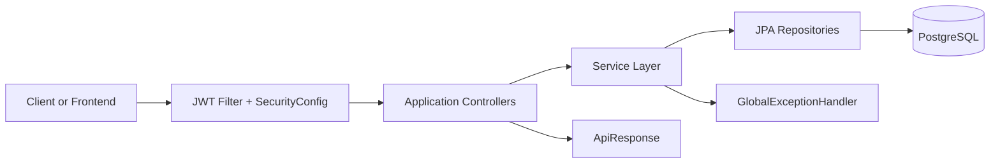
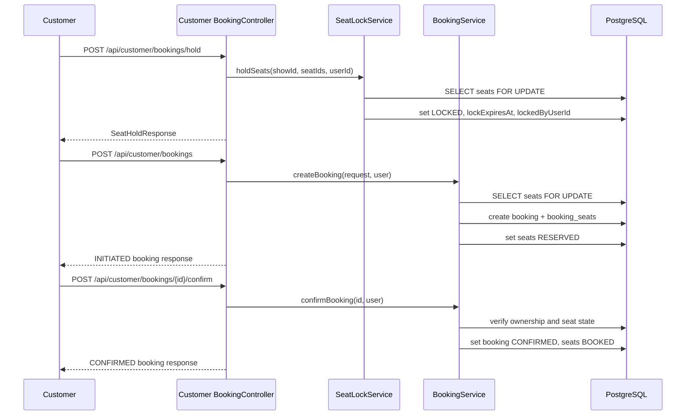
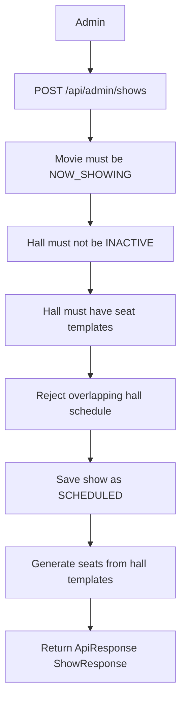

# Technical Requirements Document

## Technical Overview

Hamro Chalchitraghar backend V2 is a Java 21 Spring Boot 3.5.9 REST API for cinema catalog, schedule, seat, and booking operations.

Persistence uses Spring Data JPA, Hibernate, PostgreSQL, and Flyway migrations. Security is stateless and based on JWT bearer tokens. Controllers are grouped by role-specific application packages.



## Tech Stack

- Java 21
- Spring Boot 3.5.9
- Spring Web
- Spring Security
- Spring Data JPA
- Spring Validation
- PostgreSQL JDBC driver
- Flyway
- JJWT 0.11.5
- Lombok
- Maven wrapper
- JUnit, Spring Boot Test, MockMvc, Spring Security Test
- H2 for the `test` profile

## System Architecture

Application packages:

- `applications/auth`: auth controller.
- `applications/publicapi`: public browsing and health controllers.
- `applications/customer`: customer profile and booking controllers.
- `applications/staff`: staff booking lookup controller.
- `applications/admin`: admin management controllers.

Domain packages:

- `modules/auth`
- `modules/users`
- `modules/movies`
- `modules/halls`
- `modules/shows`
- `modules/seats`
- `modules/bookings`

Shared packages:

- `shared/config`
- `shared/security`
- `shared/exception`
- `shared/response`

## Main Modules And Responsibilities

| Module | Responsibility |
| --- | --- |
| Auth | Register users, authenticate credentials, refresh JWT tokens. |
| Users | Store users and expose admin user reads. |
| Movies | Manage and read movie metadata and release status. |
| Halls | Manage halls and active/inactive state. |
| Seat Layout | Generate reusable hall seat templates. |
| Shows | Schedule shows and generate show-specific seats. |
| Seats | Read show seat availability and manage hold state. |
| Bookings | Hold seats, create bookings, confirm bookings, cancel bookings, read bookings. |
| Security | Enforce public/customer/staff/admin route access and populate current user. |
| Response | Standardize success and error response shape. |

## Booking Flow



## Show Creation Flow



## API Design

- Base URL for local development: `http://localhost:8080`.
- API prefix: `/api`.
- Public auth endpoints: `/api/auth/**`.
- Public browsing endpoints: `/api/public/**`.
- Customer endpoints: `/api/customer/**`, requires `CUSTOMER`, `STAFF`, or `ADMIN`.
- Staff endpoints: `/api/staff/**`, requires `STAFF` or `ADMIN`.
- Admin endpoints: `/api/admin/**`, requires `ADMIN`.
- Request validation uses Jakarta Bean Validation annotations.
- Non-empty responses use `ApiResponse<T>`.

Standard response:

```json
{
  "success": true,
  "message": "Success message",
  "data": {},
  "errors": []
}
```

## Database And Schema

Tables:

- `users`
- `movies`
- `halls`
- `seat_templates`
- `shows`
- `seats`
- `bookings`
- `booking_seats`

Schema management:

- Flyway migrations under `src/main/resources/db/migration`.
- Hibernate `ddl-auto: validate`.
- PostgreSQL for dev and prod.
- H2 in PostgreSQL compatibility mode for tests.

## Auth And Security Approach

- Passwords are hashed with BCrypt.
- JWT tokens are generated with email as the subject and role as a custom claim.
- JWT secret and expiration are configured through environment variables.
- `JwtAuthenticationFilter` reads `Authorization: Bearer <token>`, validates the token, loads the user by email, and sets Spring Security authentication with `ROLE_{role}`.
- CORS allowed origins are configured through `CORS_ALLOWED_ORIGINS`.
- CSRF is disabled because the API is stateless.
- Security-level `401` and `403` responses use `ApiResponse`.

## Error Handling

`GlobalExceptionHandler` maps exceptions as follows:

| Exception | Status |
| --- | --- |
| `ResourceNotFoundException`, `EntityNotFoundException`, `EmptyResultDataAccessException` | 404 |
| `AuthenticationException` | 401 |
| `AccessDeniedException` | 403 |
| `HallConflictException`, `SeatAlreadyBookedException`, `SeatLockedException`, `DataIntegrityViolationException` | 409 |
| `InvalidSeatSelectionException`, `InvalidBookingStateException`, validation/type/body errors, `IllegalArgumentException` | 400 |
| `DataAccessException`, unhandled `Exception` | 500 |

Validation errors return:

```json
{
  "success": false,
  "message": "Validation failed",
  "data": null,
  "errors": ["field: message"]
}
```

## Performance And Consistency Considerations

- Seat hold and booking reads use pessimistic write locks to reduce double-booking risk.
- Hall has indexes on `name` and `status`.
- Show overlap check is handled in a database query.
- `findAll()` endpoints are not paginated.
- Expired locks are handled when touched by hold or booking operations and through an expired-lock cleanup job component.

## Deployment Considerations

- Dev and prod use PostgreSQL.
- Secrets and environment-specific values should be provided through environment variables.
- Flyway must be allowed to apply migrations on startup.
- Hibernate validates the schema after migrations.
- Dockerfile, Docker Compose, and GitHub Actions test CI are implemented.
- Production deployment automation is not implemented yet.
- Production host, database provisioning, secrets manager, logging aggregation, and monitoring stack are still project decisions.
